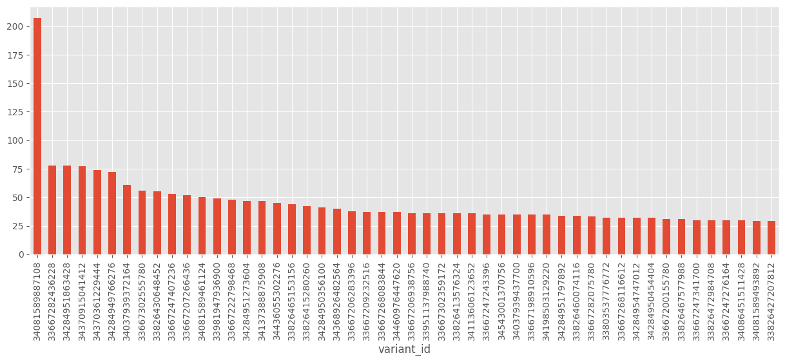
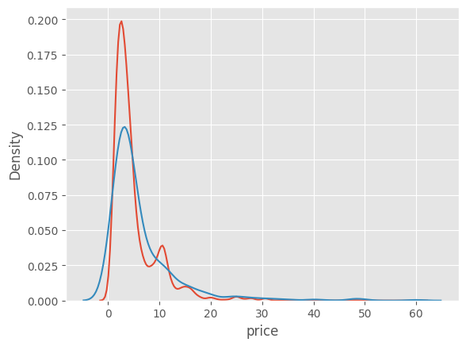
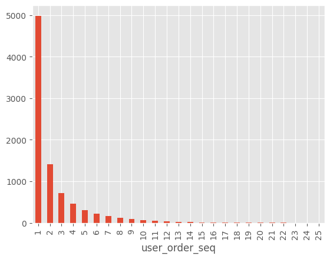

Modulo 2 : Exploratory Data Analyse


```python
!poetry add pyarrow
```

    Using version ^17.0.0 for pyarrow
    
    Updating dependencies
    Resolving dependencies...
    
    Package operations: 1 install, 0 updates, 0 removals
    
      - Installing sklearn (0.0.post7)
    
      ChefBuildError
    
      Backend subprocess exited when trying to invoke get_requires_for_build_wheel
      
      The 'sklearn' PyPI package is deprecated, use 'scikit-learn'
    
      rather than 'sklearn' for pip commands. 
    
      
    
      Here is how to fix this error in the main use cases:
    
      - use 'pip install scikit-learn' rather than 'pip install sklearn'
    
      - replace 'sklearn' by 'scikit-learn' in your pip requirements files
    
        (requirements.txt, setup.py, setup.cfg, Pipfile, etc ...)
    
      - if the 'sklearn' package is used by one of your dependencies,
    
        it would be great if you take some time to track which package uses
    
        'sklearn' instead of 'scikit-learn' and report it to their issue tracker
    
      - as a last resort, set the environment variable
    
        SKLEARN_ALLOW_DEPRECATED_SKLEARN_PACKAGE_INSTALL=True to avoid this error
    
      
    
      More information is available at
    
      https://github.com/scikit-learn/sklearn-pypi-package
    
      
    
      If the previous advice does not cover your use case, feel free to report it at
    
      https://github.com/scikit-learn/sklearn-pypi-package/issues/new
    
      
    
      at ~\pipx\venvs\poetry\Lib\site-packages\poetry\installation\chef.py:164 in _prepare
          160│ 
          161│                 error = ChefBuildError("\n\n".join(message_parts))
          162│ 
          163│             if error is not None:
        → 164│                 raise error from None
          165│ 
          166│             return path
          167│ 
          168│     def _prepare_sdist(self, archive: Path, destination: Path | None = None) -> Path:
    
    Note: This error originates from the build backend, and is likely not a problem with poetry but with sklearn (0.0.post7) not supporting PEP 517 builds. You can verify this by running 'pip wheel --no-cache-dir --use-pep517 "sklearn (==0.0.post7)"'.
    
    


```python
!poetry add seaborn
```

    Using version ^0.13.2 for seaborn
    
    Updating dependencies
    Resolving dependencies...
    
    Package operations: 1 install, 0 updates, 0 removals
    
      - Installing sklearn (0.0.post7)
    
      ChefBuildError
    
      Backend subprocess exited when trying to invoke get_requires_for_build_wheel
      
      The 'sklearn' PyPI package is deprecated, use 'scikit-learn'
    
      rather than 'sklearn' for pip commands. 
    
      
    
      Here is how to fix this error in the main use cases:
    
      - use 'pip install scikit-learn' rather than 'pip install sklearn'
    
      - replace 'sklearn' by 'scikit-learn' in your pip requirements files
    
        (requirements.txt, setup.py, setup.cfg, Pipfile, etc ...)
    
      - if the 'sklearn' package is used by one of your dependencies,
    
        it would be great if you take some time to track which package uses
    
        'sklearn' instead of 'scikit-learn' and report it to their issue tracker
    
      - as a last resort, set the environment variable
    
        SKLEARN_ALLOW_DEPRECATED_SKLEARN_PACKAGE_INSTALL=True to avoid this error
    
      
    
      More information is available at
    
      https://github.com/scikit-learn/sklearn-pypi-package
    
      
    
      If the previous advice does not cover your use case, feel free to report it at
    
      https://github.com/scikit-learn/sklearn-pypi-package/issues/new
    
      
    
      at ~\pipx\venvs\poetry\Lib\site-packages\poetry\installation\chef.py:164 in _prepare
          160│ 
          161│                 error = ChefBuildError("\n\n".join(message_parts))
          162│ 
          163│             if error is not None:
        → 164│                 raise error from None
          165│ 
          166│             return path
          167│ 
          168│     def _prepare_sdist(self, archive: Path, destination: Path | None = None) -> Path:
    
    Note: This error originates from the build backend, and is likely not a problem with poetry but with sklearn (0.0.post7) not supporting PEP 517 builds. You can verify this by running 'pip wheel --no-cache-dir --use-pep517 "sklearn (==0.0.post7)"'.
    
    


```python
import pandas as pd
import matplotlib as plt
import numpy as np
import seaborn as sns

plt.style.use("ggplot")
```


```python
import os
from dotenv import load_dotenv
import boto3
import ctypes, sys

# Load the .env file
load_dotenv()

# Now you can access the environment variables
aws_access_key = os.getenv('AWS_ACCESS_KEY_ID')
aws_secret_key = os.getenv('AWS_SECRET_ACCESS_KEY')
aws_region = os.getenv('AWS_DEFAULT_REGION')
db_url = os.getenv('DATABASE_URL')

s3 = boto3.client(
    's3',
    aws_access_key_id=aws_access_key,
    aws_secret_access_key=aws_secret_key,
    region_name=aws_region
)
```


```python
def download_file_from_s3(bucket_name, file_key, download_path):
    try:
        # Download the file from the specified S3 bucket
        s3.download_file(bucket_name, file_key, download_path)
        print(f"File '{file_key}' downloaded successfully to {download_path}")
    except Exception as e:
        print(f"Error downloading file: {e}")
```


```python
def list_files_in_bucket(bucket_name):
    try:
        response = s3.list_objects_v2(Bucket=bucket_name)
        if 'Contents' in response:
            print("Files in bucket:")
            for obj in response['Contents']:
                print(obj['Key'])
        else:
            print(f"No files found in bucket {bucket_name}")
    except Exception as e:
        print(f"Error listing files in bucket: {e}")
```


```python
bucket_name = 'zrive-ds-data'
file_key = 'groceries/box_builder_dataset/feature_frame.csv'  # The S3 object key (file path in the bucket)
download_path = r'C:\Users\Alberto\Desktop\Zrive\zrive-ds\Data set_Modulo2\model.joblib'  # Where to save the file locally
list_files_in_bucket(bucket_name)
```

    Files in bucket:
    groceries/box_builder_dataset/feature_frame.csv
    groceries/sampled-datasets/abandoned_carts.parquet
    groceries/sampled-datasets/inventory.parquet
    groceries/sampled-datasets/orders.parquet
    groceries/sampled-datasets/regulars.parquet
    groceries/sampled-datasets/users.parquet
    groceries/trained-models/model.joblib
    


```python
download_file_from_s3(bucket_name,"groceries/trained-models/model.joblib"
, download_path)
```

    File 'groceries/trained-models/model.joblib' downloaded successfully to C:\Users\Alberto\Desktop\Zrive\zrive-ds\Data set_Modulo2\model.joblib
    


```python
download_path = r'C:\Users\Alberto\Desktop\Zrive\zrive-ds\Data set_Modulo2\feature_frame.csv'
download_file_from_s3(bucket_name,"groceries/box_builder_dataset/feature_frame.csv"
, download_path)
```

    File 'groceries/box_builder_dataset/feature_frame.csv' downloaded successfully to C:\Users\Alberto\Desktop\Zrive\zrive-ds\Data set_Modulo2\feature_frame.csv
    


```python
download_path = r'C:\Users\Alberto\Desktop\Zrive\zrive-ds\Data set_Modulo2\inventory.parquet'
download_file_from_s3(bucket_name,"groceries/sampled-datasets/inventory.parquet"
, download_path)
```

    File 'groceries/sampled-datasets/inventory.parquet' downloaded successfully to C:\Users\Alberto\Desktop\Zrive\zrive-ds\Data set_Modulo2\inventory.parquet
    


```python
download_path = r'C:\Users\Alberto\Desktop\Zrive\zrive-ds\Data set_Modulo2\abandoned_carts.parquet'
download_file_from_s3(bucket_name,"groceries/sampled-datasets/abandoned_carts.parquet"
, download_path)
```

    File 'groceries/sampled-datasets/abandoned_carts.parquet' downloaded successfully to C:\Users\Alberto\Desktop\Zrive\zrive-ds\Data set_Modulo2\abandoned_carts.parquet
    


```python
download_path = r'C:\Users\Alberto\Desktop\Zrive\zrive-ds\Data set_Modulo2\orders.parquet'
download_file_from_s3(bucket_name,"groceries/sampled-datasets/orders.parquet"
, download_path)
```

    File 'groceries/sampled-datasets/orders.parquet' downloaded successfully to C:\Users\Alberto\Desktop\Zrive\zrive-ds\Data set_Modulo2\orders.parquet
    


```python
download_path = r'C:\Users\Alberto\Desktop\Zrive\zrive-ds\Data set_Modulo2\regulars.parquet'
download_file_from_s3(bucket_name,"groceries/sampled-datasets/regulars.parquet"
, download_path)
```

    File 'groceries/sampled-datasets/regulars.parquet' downloaded successfully to C:\Users\Alberto\Desktop\Zrive\zrive-ds\Data set_Modulo2\regulars.parquet
    


```python
download_path = r'C:\Users\Alberto\Desktop\Zrive\zrive-ds\Data set_Modulo2\users.parquet'
download_file_from_s3(bucket_name,"groceries/sampled-datasets/users.parquet"
, download_path)
```

    File 'groceries/sampled-datasets/users.parquet' downloaded successfully to C:\Users\Alberto\Desktop\Zrive\zrive-ds\Data set_Modulo2\users.parquet
    


```python
download_path = r'C:\Users\Alberto\Desktop\Zrive\zrive-ds\Data set_Modulo2\users.parquet'
download_file_from_s3(bucket_name,"groceries/sampled-datasets/users.parquet"
, download_path)
```


```python
orders = pd.read_parquet(r'C:\Users\Alberto\Desktop\Zrive\zrive-ds\Data set_Modulo2\orders.parquet')
orders.info()
```

    <class 'pandas.core.frame.DataFrame'>
    Index: 8773 entries, 10 to 64538
    Data columns (total 6 columns):
     #   Column          Non-Null Count  Dtype         
    ---  ------          --------------  -----         
     0   id              8773 non-null   int64         
     1   user_id         8773 non-null   object        
     2   created_at      8773 non-null   datetime64[us]
     3   order_date      8773 non-null   datetime64[us]
     4   user_order_seq  8773 non-null   int64         
     5   ordered_items   8773 non-null   object        
    dtypes: datetime64[us](2), int64(2), object(2)
    memory usage: 479.8+ KB
    


```python
orders.head()
```


<div>
<style scoped>
    .dataframe tbody tr th:only-of-type {
        vertical-align: middle;
    }

    .dataframe tbody tr th {
        vertical-align: top;
    }

    .dataframe thead th {
        text-align: right;
    }
</style>
<table border="1" class="dataframe">
  <thead>
    <tr style="text-align: right;">
      <th></th>
      <th>id</th>
      <th>user_id</th>
      <th>created_at</th>
      <th>order_date</th>
      <th>user_order_seq</th>
      <th>ordered_items</th>
    </tr>
  </thead>
  <tbody>
    <tr>
      <th>10</th>
      <td>2204073066628</td>
      <td>62e271062eb827e411bd73941178d29b022f5f2de9d37f...</td>
      <td>2020-04-30 14:32:19</td>
      <td>2020-04-30</td>
      <td>1</td>
      <td>[33618849693828, 33618860179588, 3361887404045...</td>
    </tr>
    <tr>
      <th>20</th>
      <td>2204707520644</td>
      <td>bf591c887c46d5d3513142b6a855dd7ffb9cc00697f6f5...</td>
      <td>2020-04-30 17:39:00</td>
      <td>2020-04-30</td>
      <td>1</td>
      <td>[33618835243140, 33618835964036, 3361886244058...</td>
    </tr>
    <tr>
      <th>21</th>
      <td>2204838822020</td>
      <td>329f08c66abb51f8c0b8a9526670da2d94c0c6eef06700...</td>
      <td>2020-04-30 18:12:30</td>
      <td>2020-04-30</td>
      <td>1</td>
      <td>[33618891145348, 33618893570180, 3361889766618...</td>
    </tr>
    <tr>
      <th>34</th>
      <td>2208967852164</td>
      <td>f6451fce7b1c58d0effbe37fcb4e67b718193562766470...</td>
      <td>2020-05-01 19:44:11</td>
      <td>2020-05-01</td>
      <td>1</td>
      <td>[33618830196868, 33618846580868, 3361891234624...</td>
    </tr>
    <tr>
      <th>49</th>
      <td>2215889436804</td>
      <td>68e872ff888303bff58ec56a3a986f77ddebdbe5c279e7...</td>
      <td>2020-05-03 21:56:14</td>
      <td>2020-05-03</td>
      <td>1</td>
      <td>[33667166699652, 33667166699652, 3366717122163...</td>
    </tr>
  </tbody>
</table>
</div>


```python
users = pd.read_parquet(r'C:\Users\Alberto\Desktop\Zrive\zrive-ds\Data set_Modulo2\users.parquet')
users.info()
```

    <class 'pandas.core.frame.DataFrame'>
    Index: 4983 entries, 2160 to 3360
    Data columns (total 10 columns):
     #   Column                 Non-Null Count  Dtype  
    ---  ------                 --------------  -----  
     0   user_id                4983 non-null   object 
     1   user_segment           4983 non-null   object 
     2   user_nuts1             4932 non-null   object 
     3   first_ordered_at       4983 non-null   object 
     4   customer_cohort_month  4983 non-null   object 
     5   count_people           325 non-null    float64
     6   count_adults           325 non-null    float64
     7   count_children         325 non-null    float64
     8   count_babies           325 non-null    float64
     9   count_pets             325 non-null    float64
    dtypes: float64(5), object(5)
    memory usage: 428.2+ KB
    


```python
users.head()
```


<div>
<style scoped>
    .dataframe tbody tr th:only-of-type {
        vertical-align: middle;
    }

    .dataframe tbody tr th {
        vertical-align: top;
    }

    .dataframe thead th {
        text-align: right;
    }
</style>
<table border="1" class="dataframe">
  <thead>
    <tr style="text-align: right;">
      <th></th>
      <th>user_id</th>
      <th>user_segment</th>
      <th>user_nuts1</th>
      <th>first_ordered_at</th>
      <th>customer_cohort_month</th>
      <th>count_people</th>
      <th>count_adults</th>
      <th>count_children</th>
      <th>count_babies</th>
      <th>count_pets</th>
    </tr>
  </thead>
  <tbody>
    <tr>
      <th>2160</th>
      <td>0e823a42e107461379e5b5613b7aa00537a72e1b0eaa7a...</td>
      <td>Top Up</td>
      <td>UKH</td>
      <td>2021-05-08 13:33:49</td>
      <td>2021-05-01 00:00:00</td>
      <td>NaN</td>
      <td>NaN</td>
      <td>NaN</td>
      <td>NaN</td>
      <td>NaN</td>
    </tr>
    <tr>
      <th>1123</th>
      <td>15768ced9bed648f745a7aa566a8895f7a73b9a47c1d4f...</td>
      <td>Top Up</td>
      <td>UKJ</td>
      <td>2021-11-17 16:30:20</td>
      <td>2021-11-01 00:00:00</td>
      <td>NaN</td>
      <td>NaN</td>
      <td>NaN</td>
      <td>NaN</td>
      <td>NaN</td>
    </tr>
    <tr>
      <th>1958</th>
      <td>33e0cb6eacea0775e34adbaa2c1dec16b9d6484e6b9324...</td>
      <td>Top Up</td>
      <td>UKD</td>
      <td>2022-03-09 23:12:25</td>
      <td>2022-03-01 00:00:00</td>
      <td>NaN</td>
      <td>NaN</td>
      <td>NaN</td>
      <td>NaN</td>
      <td>NaN</td>
    </tr>
    <tr>
      <th>675</th>
      <td>57ca7591dc79825df0cecc4836a58e6062454555c86c35...</td>
      <td>Top Up</td>
      <td>UKI</td>
      <td>2021-04-23 16:29:02</td>
      <td>2021-04-01 00:00:00</td>
      <td>NaN</td>
      <td>NaN</td>
      <td>NaN</td>
      <td>NaN</td>
      <td>NaN</td>
    </tr>
    <tr>
      <th>4694</th>
      <td>085d8e598139ce6fc9f75d9de97960fa9e1457b409ec00...</td>
      <td>Top Up</td>
      <td>UKJ</td>
      <td>2021-11-02 13:50:06</td>
      <td>2021-11-01 00:00:00</td>
      <td>NaN</td>
      <td>NaN</td>
      <td>NaN</td>
      <td>NaN</td>
      <td>NaN</td>
    </tr>
  </tbody>
</table>
</div>


```python
users.dropna().head()
```


<div>
<style scoped>
    .dataframe tbody tr th:only-of-type {
        vertical-align: middle;
    }

    .dataframe tbody tr th {
        vertical-align: top;
    }

    .dataframe thead th {
        text-align: right;
    }
</style>
<table border="1" class="dataframe">
  <thead>
    <tr style="text-align: right;">
      <th></th>
      <th>user_id</th>
      <th>user_segment</th>
      <th>user_nuts1</th>
      <th>first_ordered_at</th>
      <th>customer_cohort_month</th>
      <th>count_people</th>
      <th>count_adults</th>
      <th>count_children</th>
      <th>count_babies</th>
      <th>count_pets</th>
    </tr>
  </thead>
  <tbody>
    <tr>
      <th>4751</th>
      <td>09d70e0b0778117aec5550c08032d56f8e06f992741680...</td>
      <td>Proposition</td>
      <td>UKI</td>
      <td>2021-06-28 12:07:04</td>
      <td>2021-06-01 00:00:00</td>
      <td>1.0</td>
      <td>1.0</td>
      <td>0.0</td>
      <td>0.0</td>
      <td>0.0</td>
    </tr>
    <tr>
      <th>3154</th>
      <td>4f5ff38ce5ed48096ba80dff80e167db1ad24b9ebdb00c...</td>
      <td>Top Up</td>
      <td>UKD</td>
      <td>2020-06-12 12:07:35</td>
      <td>2020-06-01 00:00:00</td>
      <td>3.0</td>
      <td>2.0</td>
      <td>0.0</td>
      <td>1.0</td>
      <td>0.0</td>
    </tr>
    <tr>
      <th>736</th>
      <td>7b2ae50bb11646436fa613394fc3e71e1a0cdc3ba30cdb...</td>
      <td>Proposition</td>
      <td>UKF</td>
      <td>2020-10-03 09:53:57</td>
      <td>2020-10-01 00:00:00</td>
      <td>2.0</td>
      <td>2.0</td>
      <td>0.0</td>
      <td>0.0</td>
      <td>2.0</td>
    </tr>
    <tr>
      <th>4792</th>
      <td>5e977a4aa2c57f306b8a22f92eaaa177f7dc31a52df82c...</td>
      <td>Proposition</td>
      <td>UKI</td>
      <td>2021-10-14 10:41:13</td>
      <td>2021-10-01 00:00:00</td>
      <td>2.0</td>
      <td>1.0</td>
      <td>1.0</td>
      <td>0.0</td>
      <td>1.0</td>
    </tr>
    <tr>
      <th>2217</th>
      <td>eafb89ad33eb377adb98a915b6a5a65f1284c2db517d07...</td>
      <td>Proposition</td>
      <td>UKH</td>
      <td>2022-01-20 15:53:09</td>
      <td>2022-01-01 00:00:00</td>
      <td>2.0</td>
      <td>2.0</td>
      <td>0.0</td>
      <td>0.0</td>
      <td>0.0</td>
    </tr>
  </tbody>
</table>
</div>


```python
regulars = pd.read_parquet(r'C:\Users\Alberto\Desktop\Zrive\zrive-ds\Data set_Modulo2\regulars.parquet')
regulars.info()
```

    <class 'pandas.core.frame.DataFrame'>
    Index: 18105 entries, 3 to 37720
    Data columns (total 3 columns):
     #   Column      Non-Null Count  Dtype         
    ---  ------      --------------  -----         
     0   user_id     18105 non-null  object        
     1   variant_id  18105 non-null  int64         
     2   created_at  18105 non-null  datetime64[us]
    dtypes: datetime64[us](1), int64(1), object(1)
    memory usage: 565.8+ KB
    


```python
regulars.head()
```


<div>
<style scoped>
    .dataframe tbody tr th:only-of-type {
        vertical-align: middle;
    }

    .dataframe tbody tr th {
        vertical-align: top;
    }

    .dataframe thead th {
        text-align: right;
    }
</style>
<table border="1" class="dataframe">
  <thead>
    <tr style="text-align: right;">
      <th></th>
      <th>user_id</th>
      <th>variant_id</th>
      <th>created_at</th>
    </tr>
  </thead>
  <tbody>
    <tr>
      <th>3</th>
      <td>68e872ff888303bff58ec56a3a986f77ddebdbe5c279e7...</td>
      <td>33618848088196</td>
      <td>2020-04-30 15:07:03</td>
    </tr>
    <tr>
      <th>11</th>
      <td>aed88fc0b004270a62ff1fe4b94141f6b1db1496dbb0c0...</td>
      <td>33667178659972</td>
      <td>2020-05-05 23:34:35</td>
    </tr>
    <tr>
      <th>18</th>
      <td>68e872ff888303bff58ec56a3a986f77ddebdbe5c279e7...</td>
      <td>33619009208452</td>
      <td>2020-04-30 15:07:03</td>
    </tr>
    <tr>
      <th>46</th>
      <td>aed88fc0b004270a62ff1fe4b94141f6b1db1496dbb0c0...</td>
      <td>33667305373828</td>
      <td>2020-05-05 23:34:35</td>
    </tr>
    <tr>
      <th>47</th>
      <td>4594e99557113d5a1c5b59bf31b8704aafe5c7bd180b32...</td>
      <td>33667247341700</td>
      <td>2020-05-06 14:42:11</td>
    </tr>
  </tbody>
</table>
</div>


```python
inventory = pd.read_parquet(r'C:\Users\Alberto\Desktop\Zrive\zrive-ds\Data set_Modulo2\inventory.parquet')
inventory.info()
```

    <class 'pandas.core.frame.DataFrame'>
    RangeIndex: 1733 entries, 0 to 1732
    Data columns (total 6 columns):
     #   Column            Non-Null Count  Dtype  
    ---  ------            --------------  -----  
     0   variant_id        1733 non-null   int64  
     1   price             1733 non-null   float64
     2   compare_at_price  1733 non-null   float64
     3   vendor            1733 non-null   object 
     4   product_type      1733 non-null   object 
     5   tags              1733 non-null   object 
    dtypes: float64(2), int64(1), object(3)
    memory usage: 81.4+ KB
    


```python
inventory.head()
```


<div>
<style scoped>
    .dataframe tbody tr th:only-of-type {
        vertical-align: middle;
    }

    .dataframe tbody tr th {
        vertical-align: top;
    }

    .dataframe thead th {
        text-align: right;
    }
</style>
<table border="1" class="dataframe">
  <thead>
    <tr style="text-align: right;">
      <th></th>
      <th>variant_id</th>
      <th>price</th>
      <th>compare_at_price</th>
      <th>vendor</th>
      <th>product_type</th>
      <th>tags</th>
    </tr>
  </thead>
  <tbody>
    <tr>
      <th>0</th>
      <td>39587297165444</td>
      <td>3.09</td>
      <td>3.15</td>
      <td>heinz</td>
      <td>condiments-dressings</td>
      <td>[table-sauces, vegan]</td>
    </tr>
    <tr>
      <th>1</th>
      <td>34370361229444</td>
      <td>4.99</td>
      <td>5.50</td>
      <td>whogivesacrap</td>
      <td>toilet-roll-kitchen-roll-tissue</td>
      <td>[b-corp, eco, toilet-rolls]</td>
    </tr>
    <tr>
      <th>2</th>
      <td>34284951863428</td>
      <td>3.69</td>
      <td>3.99</td>
      <td>plenty</td>
      <td>toilet-roll-kitchen-roll-tissue</td>
      <td>[kitchen-roll]</td>
    </tr>
    <tr>
      <th>3</th>
      <td>33667283583108</td>
      <td>1.79</td>
      <td>1.99</td>
      <td>thecheekypanda</td>
      <td>toilet-roll-kitchen-roll-tissue</td>
      <td>[b-corp, cruelty-free, eco, tissue, vegan]</td>
    </tr>
    <tr>
      <th>4</th>
      <td>33803537973380</td>
      <td>1.99</td>
      <td>2.09</td>
      <td>colgate</td>
      <td>dental</td>
      <td>[dental-accessories]</td>
    </tr>
  </tbody>
</table>
</div>


```python
abandoned_carts = pd.read_parquet(r'C:\Users\Alberto\Desktop\Zrive\zrive-ds\Data set_Modulo2\abandoned_carts.parquet')
abandoned_carts.info()
```

    <class 'pandas.core.frame.DataFrame'>
    Index: 5457 entries, 0 to 70050
    Data columns (total 4 columns):
     #   Column      Non-Null Count  Dtype         
    ---  ------      --------------  -----         
     0   id          5457 non-null   int64         
     1   user_id     5457 non-null   object        
     2   created_at  5457 non-null   datetime64[us]
     3   variant_id  5457 non-null   object        
    dtypes: datetime64[us](1), int64(1), object(2)
    memory usage: 213.2+ KB
    

Tenemos ya los datos de todos los archivos parquet y en Pandas.

Pasamos al analisis:

1. Profiling buyer population
2. Analyse regulars products
3. Reconstruct orders and abandoneed orders with inventory information.

1. Profiling buyer population


```python
n_regulars = (
    regulars.groupby("user_id") ["variant_id"]
    .nunique()
    .reset_index()
    .rename(columns={"variant_id": "n_regulars"})
)

users = users.merge(n_regulars, on="user_id", how = "left").fillna({"n_regulars":0})
```


```python
users.head()
```


<div>
<style scoped>
    .dataframe tbody tr th:only-of-type {
        vertical-align: middle;
    }

    .dataframe tbody tr th {
        vertical-align: top;
    }

    .dataframe thead th {
        text-align: right;
    }
</style>
<table border="1" class="dataframe">
  <thead>
    <tr style="text-align: right;">
      <th></th>
      <th>user_id</th>
      <th>user_segment</th>
      <th>user_nuts1</th>
      <th>first_ordered_at</th>
      <th>customer_cohort_month</th>
      <th>count_people</th>
      <th>count_adults</th>
      <th>count_children</th>
      <th>count_babies</th>
      <th>count_pets</th>
      <th>n_regulars</th>
    </tr>
  </thead>
  <tbody>
    <tr>
      <th>0</th>
      <td>0e823a42e107461379e5b5613b7aa00537a72e1b0eaa7a...</td>
      <td>Top Up</td>
      <td>UKH</td>
      <td>2021-05-08 13:33:49</td>
      <td>2021-05-01 00:00:00</td>
      <td>NaN</td>
      <td>NaN</td>
      <td>NaN</td>
      <td>NaN</td>
      <td>NaN</td>
      <td>0.0</td>
    </tr>
    <tr>
      <th>1</th>
      <td>15768ced9bed648f745a7aa566a8895f7a73b9a47c1d4f...</td>
      <td>Top Up</td>
      <td>UKJ</td>
      <td>2021-11-17 16:30:20</td>
      <td>2021-11-01 00:00:00</td>
      <td>NaN</td>
      <td>NaN</td>
      <td>NaN</td>
      <td>NaN</td>
      <td>NaN</td>
      <td>0.0</td>
    </tr>
    <tr>
      <th>2</th>
      <td>33e0cb6eacea0775e34adbaa2c1dec16b9d6484e6b9324...</td>
      <td>Top Up</td>
      <td>UKD</td>
      <td>2022-03-09 23:12:25</td>
      <td>2022-03-01 00:00:00</td>
      <td>NaN</td>
      <td>NaN</td>
      <td>NaN</td>
      <td>NaN</td>
      <td>NaN</td>
      <td>0.0</td>
    </tr>
    <tr>
      <th>3</th>
      <td>57ca7591dc79825df0cecc4836a58e6062454555c86c35...</td>
      <td>Top Up</td>
      <td>UKI</td>
      <td>2021-04-23 16:29:02</td>
      <td>2021-04-01 00:00:00</td>
      <td>NaN</td>
      <td>NaN</td>
      <td>NaN</td>
      <td>NaN</td>
      <td>NaN</td>
      <td>0.0</td>
    </tr>
    <tr>
      <th>4</th>
      <td>085d8e598139ce6fc9f75d9de97960fa9e1457b409ec00...</td>
      <td>Top Up</td>
      <td>UKJ</td>
      <td>2021-11-02 13:50:06</td>
      <td>2021-11-01 00:00:00</td>
      <td>NaN</td>
      <td>NaN</td>
      <td>NaN</td>
      <td>NaN</td>
      <td>NaN</td>
      <td>0.0</td>
    </tr>
  </tbody>
</table>
</div>


```python
users.dropna().head()
```


<div>
<style scoped>
    .dataframe tbody tr th:only-of-type {
        vertical-align: middle;
    }

    .dataframe tbody tr th {
        vertical-align: top;
    }

    .dataframe thead th {
        text-align: right;
    }
</style>
<table border="1" class="dataframe">
  <thead>
    <tr style="text-align: right;">
      <th></th>
      <th>user_id</th>
      <th>user_segment</th>
      <th>user_nuts1</th>
      <th>first_ordered_at</th>
      <th>customer_cohort_month</th>
      <th>count_people</th>
      <th>count_adults</th>
      <th>count_children</th>
      <th>count_babies</th>
      <th>count_pets</th>
      <th>n_regulars</th>
    </tr>
  </thead>
  <tbody>
    <tr>
      <th>23</th>
      <td>09d70e0b0778117aec5550c08032d56f8e06f992741680...</td>
      <td>Proposition</td>
      <td>UKI</td>
      <td>2021-06-28 12:07:04</td>
      <td>2021-06-01 00:00:00</td>
      <td>1.0</td>
      <td>1.0</td>
      <td>0.0</td>
      <td>0.0</td>
      <td>0.0</td>
      <td>0.0</td>
    </tr>
    <tr>
      <th>27</th>
      <td>4f5ff38ce5ed48096ba80dff80e167db1ad24b9ebdb00c...</td>
      <td>Top Up</td>
      <td>UKD</td>
      <td>2020-06-12 12:07:35</td>
      <td>2020-06-01 00:00:00</td>
      <td>3.0</td>
      <td>2.0</td>
      <td>0.0</td>
      <td>1.0</td>
      <td>0.0</td>
      <td>1.0</td>
    </tr>
    <tr>
      <th>28</th>
      <td>7b2ae50bb11646436fa613394fc3e71e1a0cdc3ba30cdb...</td>
      <td>Proposition</td>
      <td>UKF</td>
      <td>2020-10-03 09:53:57</td>
      <td>2020-10-01 00:00:00</td>
      <td>2.0</td>
      <td>2.0</td>
      <td>0.0</td>
      <td>0.0</td>
      <td>2.0</td>
      <td>25.0</td>
    </tr>
    <tr>
      <th>35</th>
      <td>5e977a4aa2c57f306b8a22f92eaaa177f7dc31a52df82c...</td>
      <td>Proposition</td>
      <td>UKI</td>
      <td>2021-10-14 10:41:13</td>
      <td>2021-10-01 00:00:00</td>
      <td>2.0</td>
      <td>1.0</td>
      <td>1.0</td>
      <td>0.0</td>
      <td>1.0</td>
      <td>72.0</td>
    </tr>
    <tr>
      <th>66</th>
      <td>eafb89ad33eb377adb98a915b6a5a65f1284c2db517d07...</td>
      <td>Proposition</td>
      <td>UKH</td>
      <td>2022-01-20 15:53:09</td>
      <td>2022-01-01 00:00:00</td>
      <td>2.0</td>
      <td>2.0</td>
      <td>0.0</td>
      <td>0.0</td>
      <td>0.0</td>
      <td>3.0</td>
    </tr>
  </tbody>
</table>
</div>


```python
users.describe()
```


<div>
<style scoped>
    .dataframe tbody tr th:only-of-type {
        vertical-align: middle;
    }

    .dataframe tbody tr th {
        vertical-align: top;
    }

    .dataframe thead th {
        text-align: right;
    }
</style>
<table border="1" class="dataframe">
  <thead>
    <tr style="text-align: right;">
      <th></th>
      <th>count_people</th>
      <th>count_adults</th>
      <th>count_children</th>
      <th>count_babies</th>
      <th>count_pets</th>
      <th>n_regulars</th>
    </tr>
  </thead>
  <tbody>
    <tr>
      <th>count</th>
      <td>325.000000</td>
      <td>325.000000</td>
      <td>325.000000</td>
      <td>325.000000</td>
      <td>325.000000</td>
      <td>4983.000000</td>
    </tr>
    <tr>
      <th>mean</th>
      <td>2.787692</td>
      <td>2.003077</td>
      <td>0.707692</td>
      <td>0.076923</td>
      <td>0.636923</td>
      <td>2.481437</td>
    </tr>
    <tr>
      <th>std</th>
      <td>1.365753</td>
      <td>0.869577</td>
      <td>1.026246</td>
      <td>0.289086</td>
      <td>0.995603</td>
      <td>8.890588</td>
    </tr>
    <tr>
      <th>min</th>
      <td>0.000000</td>
      <td>0.000000</td>
      <td>0.000000</td>
      <td>0.000000</td>
      <td>0.000000</td>
      <td>0.000000</td>
    </tr>
    <tr>
      <th>25%</th>
      <td>2.000000</td>
      <td>2.000000</td>
      <td>0.000000</td>
      <td>0.000000</td>
      <td>0.000000</td>
      <td>0.000000</td>
    </tr>
    <tr>
      <th>50%</th>
      <td>3.000000</td>
      <td>2.000000</td>
      <td>0.000000</td>
      <td>0.000000</td>
      <td>0.000000</td>
      <td>0.000000</td>
    </tr>
    <tr>
      <th>75%</th>
      <td>4.000000</td>
      <td>2.000000</td>
      <td>1.000000</td>
      <td>0.000000</td>
      <td>1.000000</td>
      <td>1.000000</td>
    </tr>
    <tr>
      <th>max</th>
      <td>8.000000</td>
      <td>7.000000</td>
      <td>6.000000</td>
      <td>2.000000</td>
      <td>6.000000</td>
      <td>320.000000</td>
    </tr>
  </tbody>
</table>
</div>


```python
users["n_regulars"].hist(bins=100, log=True)
```


    <Axes: >


    

    


```python
users.loc[lambda x : x.n_regulars < 100].n_regulars.describe()
# Para el n_regulars filtrado con los menores de 100 ==> estadisticas del describe (Solo util para ver un poco de que van los datos)
```


    count    4981.000000
    mean        2.396105
    std         7.516721
    min         0.000000
    25%         0.000000
    50%         0.000000
    75%         1.000000
    max        90.000000
    Name: n_regulars, dtype: float64


```python
(users ["n_regulars"] > 10).sum() / len(users)
#Porcentaje de usuarios con mas de 10 productos guardados en favoritos
```


    0.07264699979931769


```python
users.loc[lambda x:x.n_regulars < 100].groupby("user_segment")["n_regulars"].mean().plot(kind="bar")
#Average numbeer of regulars per user segment
```


    <Axes: xlabel='user_segment'>


    

    


```python
family_cols = [col for col in users.columns if col.startswith("count_")]
family_inputs = users.count_people.dropna().count()

d = {f"any_{col}": (users[col] > 0).sum() / family_inputs for col in family_cols}
d
```


    {'any_count_people': 0.9938461538461538,
     'any_count_adults': 0.9907692307692307,
     'any_count_children': 0.4,
     'any_count_babies': 0.07076923076923076,
     'any_count_pets': 0.40615384615384614}


```python
(
    users[["count_pets","count_children","count_babies"]].sum(axis=1)>0
).sum() / family_inputs
```


    0.6123076923076923


```python
pd.crosstab(users["user_nuts1"],users["user_segment"]).plot(kind="bar")
```


    <Axes: xlabel='user_nuts1'>


    

    


Interpretaciones:
1. Pocas personas tienes productos regular (Solo el 7% tiene mas de 10)
2. Proposition users tienen mas regular que los top-up
3. No tenemos infomacion de la familia para la mayoria de los usuarios (solo el 6.5%)
4. La mayoria de los usuarios son parejas (Los otros casos representan menos del 25%)
5. 60% de los usuarios tienen niños, mascotas o bebes.
6. Solo el 7% de los usuarios tienen bebes

2. Understanding regular products


```python
regulars_df= regulars.merge(inventory, on="variant_id", how= "left")

```


```python
regulars_df.head()
```


<div>
<style scoped>
    .dataframe tbody tr th:only-of-type {
        vertical-align: middle;
    }

    .dataframe tbody tr th {
        vertical-align: top;
    }

    .dataframe thead th {
        text-align: right;
    }
</style>
<table border="1" class="dataframe">
  <thead>
    <tr style="text-align: right;">
      <th></th>
      <th>user_id</th>
      <th>variant_id</th>
      <th>created_at</th>
      <th>price</th>
      <th>compare_at_price</th>
      <th>vendor</th>
      <th>product_type</th>
      <th>tags</th>
    </tr>
  </thead>
  <tbody>
    <tr>
      <th>0</th>
      <td>68e872ff888303bff58ec56a3a986f77ddebdbe5c279e7...</td>
      <td>33618848088196</td>
      <td>2020-04-30 15:07:03</td>
      <td>NaN</td>
      <td>NaN</td>
      <td>NaN</td>
      <td>NaN</td>
      <td>NaN</td>
    </tr>
    <tr>
      <th>1</th>
      <td>aed88fc0b004270a62ff1fe4b94141f6b1db1496dbb0c0...</td>
      <td>33667178659972</td>
      <td>2020-05-05 23:34:35</td>
      <td>NaN</td>
      <td>NaN</td>
      <td>NaN</td>
      <td>NaN</td>
      <td>NaN</td>
    </tr>
    <tr>
      <th>2</th>
      <td>68e872ff888303bff58ec56a3a986f77ddebdbe5c279e7...</td>
      <td>33619009208452</td>
      <td>2020-04-30 15:07:03</td>
      <td>NaN</td>
      <td>NaN</td>
      <td>NaN</td>
      <td>NaN</td>
      <td>NaN</td>
    </tr>
    <tr>
      <th>3</th>
      <td>aed88fc0b004270a62ff1fe4b94141f6b1db1496dbb0c0...</td>
      <td>33667305373828</td>
      <td>2020-05-05 23:34:35</td>
      <td>NaN</td>
      <td>NaN</td>
      <td>NaN</td>
      <td>NaN</td>
      <td>NaN</td>
    </tr>
    <tr>
      <th>4</th>
      <td>4594e99557113d5a1c5b59bf31b8704aafe5c7bd180b32...</td>
      <td>33667247341700</td>
      <td>2020-05-06 14:42:11</td>
      <td>3.49</td>
      <td>3.5</td>
      <td>method</td>
      <td>cleaning-products</td>
      <td>[cruelty-free, eco, vegan, window-glass-cleaner]</td>
    </tr>
  </tbody>
</table>
</div>


```python
clean_regulars = regulars_df.dropna()
```


```python
clean_regulars.groupby(["variant_id"])["user_id"].nunique().sort_values(
    ascending=False
).head(50).plot(kind="bar", figsize=(15, 5))
```


    <Axes: xlabel='variant_id'>


    

    


```python
top_product= (
    clean_regulars.groupby(["variant_id"])["user_id"].nunique().sort_values(
    ascending=False
).head(1).index[0]
)
clean_regulars.loc[lambda x : x.variant_id == top_product][["variant_id", "price", "product_type", "vendor"]].drop_duplicates()
```


<div>
<style scoped>
    .dataframe tbody tr th:only-of-type {
        vertical-align: middle;
    }

    .dataframe tbody tr th {
        vertical-align: top;
    }

    .dataframe thead th {
        text-align: right;
    }
</style>
<table border="1" class="dataframe">
  <thead>
    <tr style="text-align: right;">
      <th></th>
      <th>variant_id</th>
      <th>price</th>
      <th>product_type</th>
      <th>vendor</th>
    </tr>
  </thead>
  <tbody>
    <tr>
      <th>95</th>
      <td>34081589887108</td>
      <td>10.79</td>
      <td>long-life-milk-substitutes</td>
      <td>oatly</td>
    </tr>
  </tbody>
</table>
</div>


```python
sns.kdeplot(clean_regulars.price, label="regulars_price")
sns.kdeplot(inventory.price, label="inventory_price")
plt.legend()
```


    ---------------------------------------------------------------------------

    TypeError                                 Traceback (most recent call last)

    Cell In[52], line 3
          1 sns.kdeplot(clean_regulars.price, label="regulars_price")
          2 sns.kdeplot(inventory.price, label="inventory_price")
    ----> 3 plt.legend()
    

    TypeError: 'module' object is not callable


    

    


```python
clean_regulars["vendor"].value_counts().head(50).plot(kind="bar", figsize=(15, 5))
plt.title(
    f"Top 50 vendors by number of regulars (out of {clean_regulars.vendor.nunique()} vendors)"
)

```


    ---------------------------------------------------------------------------

    AttributeError                            Traceback (most recent call last)

    Cell In[39], line 2
          1 clean_regulars["vendor"].value_counts().head(50).plot(kind="bar", figsize=(15, 5))
    ----> 2 plt.title(
          3     f"Top 50 vendors by number of regulars (out of {clean_regulars.vendor.nunique()} vendors)"
          4 )
    

    File c:\Users\Alberto\AppData\Local\pypoetry\Cache\virtualenvs\zrive-ds-BGhdBhXZ-py3.11\Lib\site-packages\matplotlib\_api\__init__.py:226, in caching_module_getattr.<locals>.__getattr__(name)
        224 if name in props:
        225     return props[name].__get__(instance)
    --> 226 raise AttributeError(
        227     f"module {cls.__module__!r} has no attribute {name!r}")
    

    AttributeError: module 'matplotlib' has no attribute 'title'


    

    


```python
clean_regulars["product_type"].value_counts().head(30).plot(kind="bar", figsize=(15, 5))
plt.title(
    f"Top 30 product_type by number of regulars (out of {clean_regulars.product_type.nunique()} product_types)"
)

```


    ---------------------------------------------------------------------------

    AttributeError                            Traceback (most recent call last)

    Cell In[40], line 2
          1 clean_regulars["product_type"].value_counts().head(30).plot(kind="bar", figsize=(15, 5))
    ----> 2 plt.title(
          3     f"Top 30 product_type by number of regulars (out of {clean_regulars.product_type.nunique()} product_types)"
          4 )
    

    File c:\Users\Alberto\AppData\Local\pypoetry\Cache\virtualenvs\zrive-ds-BGhdBhXZ-py3.11\Lib\site-packages\matplotlib\_api\__init__.py:226, in caching_module_getattr.<locals>.__getattr__(name)
        224 if name in props:
        225     return props[name].__get__(instance)
    --> 226 raise AttributeError(
        227     f"module {cls.__module__!r} has no attribute {name!r}")
    

    AttributeError: module 'matplotlib' has no attribute 'title'


    

    


```python
inventory["product_type"].value_counts().head(30).plot(kind="bar", figsize=(15, 5))
plt.title(
    f"Top 50 product_type by number of regulars (out of {clean_regulars.product_type.nunique()} product_types)"
)

```


    ---------------------------------------------------------------------------

    AttributeError                            Traceback (most recent call last)

    Cell In[41], line 2
          1 inventory["product_type"].value_counts().head(30).plot(kind="bar", figsize=(15, 5))
    ----> 2 plt.title(
          3     f"Top 50 product_type by number of regulars (out of {clean_regulars.product_type.nunique()} product_types)"
          4 )
    

    File c:\Users\Alberto\AppData\Local\pypoetry\Cache\virtualenvs\zrive-ds-BGhdBhXZ-py3.11\Lib\site-packages\matplotlib\_api\__init__.py:226, in caching_module_getattr.<locals>.__getattr__(name)
        224 if name in props:
        225     return props[name].__get__(instance)
    --> 226 raise AttributeError(
        227     f"module {cls.__module__!r} has no attribute {name!r}")
    

    AttributeError: module 'matplotlib' has no attribute 'title'


    

    


```python
diff_prevalence = (
    inventory["product_type"]
    .value_counts(normalize=True)
    .rename("inventory_count")
    .reset_index()
    .merge(
        clean_regulars["product_type"]
        .value_counts(normalize=True)
        .rename("regulars_count")
        .reset_index()
    )
    .assign(inventory_rank=lambda x: x.inventory_count.rank(ascending=False))
    .assign(regulars_rank=lambda x: x.regulars_count.rank(ascending=False))
    .assign(diff=lambda x: x.inventory_count - x.regulars_count)
)

```


```python
diff_prevalence.sort_values("regulars_count", ascending = False).head(10)
```


<div>
<style scoped>
    .dataframe tbody tr th:only-of-type {
        vertical-align: middle;
    }

    .dataframe tbody tr th {
        vertical-align: top;
    }

    .dataframe thead th {
        text-align: right;
    }
</style>
<table border="1" class="dataframe">
  <thead>
    <tr style="text-align: right;">
      <th></th>
      <th>product_type</th>
      <th>inventory_count</th>
      <th>regulars_count</th>
      <th>inventory_rank</th>
      <th>regulars_rank</th>
      <th>diff</th>
    </tr>
  </thead>
  <tbody>
    <tr>
      <th>0</th>
      <td>cleaning-products</td>
      <td>0.092325</td>
      <td>0.124850</td>
      <td>1.0</td>
      <td>1.0</td>
      <td>-0.032525</td>
    </tr>
    <tr>
      <th>1</th>
      <td>tins-packaged-foods</td>
      <td>0.072129</td>
      <td>0.093255</td>
      <td>2.0</td>
      <td>2.0</td>
      <td>-0.021126</td>
    </tr>
    <tr>
      <th>21</th>
      <td>dishwashing</td>
      <td>0.015580</td>
      <td>0.055474</td>
      <td>22.0</td>
      <td>3.0</td>
      <td>-0.039894</td>
    </tr>
    <tr>
      <th>31</th>
      <td>toilet-roll-kitchen-roll-tissue</td>
      <td>0.010387</td>
      <td>0.053346</td>
      <td>32.5</td>
      <td>4.0</td>
      <td>-0.042959</td>
    </tr>
    <tr>
      <th>3</th>
      <td>cooking-ingredients</td>
      <td>0.042123</td>
      <td>0.052148</td>
      <td>4.0</td>
      <td>5.0</td>
      <td>-0.010025</td>
    </tr>
    <tr>
      <th>2</th>
      <td>snacks-confectionery</td>
      <td>0.070398</td>
      <td>0.043900</td>
      <td>3.0</td>
      <td>6.0</td>
      <td>0.026498</td>
    </tr>
    <tr>
      <th>25</th>
      <td>long-life-milk-substitutes</td>
      <td>0.013849</td>
      <td>0.037648</td>
      <td>25.5</td>
      <td>7.0</td>
      <td>-0.023799</td>
    </tr>
    <tr>
      <th>6</th>
      <td>condiments-dressings</td>
      <td>0.030006</td>
      <td>0.034655</td>
      <td>7.0</td>
      <td>8.0</td>
      <td>-0.004649</td>
    </tr>
    <tr>
      <th>10</th>
      <td>soft-drinks-mixers</td>
      <td>0.027698</td>
      <td>0.032061</td>
      <td>11.0</td>
      <td>9.0</td>
      <td>-0.004363</td>
    </tr>
    <tr>
      <th>7</th>
      <td>cereal</td>
      <td>0.029429</td>
      <td>0.031329</td>
      <td>8.0</td>
      <td>10.0</td>
      <td>-0.001900</td>
    </tr>
  </tbody>
</table>
</div>


Reconstruir Orders


```python
orders.head()
```


<div>
<style scoped>
    .dataframe tbody tr th:only-of-type {
        vertical-align: middle;
    }

    .dataframe tbody tr th {
        vertical-align: top;
    }

    .dataframe thead th {
        text-align: right;
    }
</style>
<table border="1" class="dataframe">
  <thead>
    <tr style="text-align: right;">
      <th></th>
      <th>id</th>
      <th>user_id</th>
      <th>created_at</th>
      <th>order_date</th>
      <th>user_order_seq</th>
      <th>ordered_items</th>
    </tr>
  </thead>
  <tbody>
    <tr>
      <th>10</th>
      <td>2204073066628</td>
      <td>62e271062eb827e411bd73941178d29b022f5f2de9d37f...</td>
      <td>2020-04-30 14:32:19</td>
      <td>2020-04-30</td>
      <td>1</td>
      <td>[33618849693828, 33618860179588, 3361887404045...</td>
    </tr>
    <tr>
      <th>20</th>
      <td>2204707520644</td>
      <td>bf591c887c46d5d3513142b6a855dd7ffb9cc00697f6f5...</td>
      <td>2020-04-30 17:39:00</td>
      <td>2020-04-30</td>
      <td>1</td>
      <td>[33618835243140, 33618835964036, 3361886244058...</td>
    </tr>
    <tr>
      <th>21</th>
      <td>2204838822020</td>
      <td>329f08c66abb51f8c0b8a9526670da2d94c0c6eef06700...</td>
      <td>2020-04-30 18:12:30</td>
      <td>2020-04-30</td>
      <td>1</td>
      <td>[33618891145348, 33618893570180, 3361889766618...</td>
    </tr>
    <tr>
      <th>34</th>
      <td>2208967852164</td>
      <td>f6451fce7b1c58d0effbe37fcb4e67b718193562766470...</td>
      <td>2020-05-01 19:44:11</td>
      <td>2020-05-01</td>
      <td>1</td>
      <td>[33618830196868, 33618846580868, 3361891234624...</td>
    </tr>
    <tr>
      <th>49</th>
      <td>2215889436804</td>
      <td>68e872ff888303bff58ec56a3a986f77ddebdbe5c279e7...</td>
      <td>2020-05-03 21:56:14</td>
      <td>2020-05-03</td>
      <td>1</td>
      <td>[33667166699652, 33667166699652, 3366717122163...</td>
    </tr>
  </tbody>
</table>
</div>


```python
orders.order_date.min(), orders.order_date.max()
```


    (Timestamp('2020-04-30 00:00:00'), Timestamp('2022-03-14 00:00:00'))


```python
orders.user_id.nunique()
```


    4983


```python
orders.loc[lambda x: x.user_order_seq > 1].user_id.nunique()
```


    1411


```python
orders["user_order_seq"].value_counts().plot(kind="bar")
```


    <Axes: xlabel='user_order_seq'>


    

    


```python
orders.user_order_seq.value_counts(normalize=True).plot(kind="bar") # Cual es la diferencia entre llamar a user_order_seq asi o como hago arriba orders["user_order_seq"]. Es lo mismo?
```


    <Axes: xlabel='user_order_seq'>


    

    


```python
order_items = orders.explode("ordered_items").rename(
    {"ordered_items" : "variant_id"}, axis=1
)
```


```python
order_items.head()
```


<div>
<style scoped>
    .dataframe tbody tr th:only-of-type {
        vertical-align: middle;
    }

    .dataframe tbody tr th {
        vertical-align: top;
    }

    .dataframe thead th {
        text-align: right;
    }
</style>
<table border="1" class="dataframe">
  <thead>
    <tr style="text-align: right;">
      <th></th>
      <th>id</th>
      <th>user_id</th>
      <th>created_at</th>
      <th>order_date</th>
      <th>user_order_seq</th>
      <th>variant_id</th>
    </tr>
  </thead>
  <tbody>
    <tr>
      <th>10</th>
      <td>2204073066628</td>
      <td>62e271062eb827e411bd73941178d29b022f5f2de9d37f...</td>
      <td>2020-04-30 14:32:19</td>
      <td>2020-04-30</td>
      <td>1</td>
      <td>33618849693828</td>
    </tr>
    <tr>
      <th>10</th>
      <td>2204073066628</td>
      <td>62e271062eb827e411bd73941178d29b022f5f2de9d37f...</td>
      <td>2020-04-30 14:32:19</td>
      <td>2020-04-30</td>
      <td>1</td>
      <td>33618860179588</td>
    </tr>
    <tr>
      <th>10</th>
      <td>2204073066628</td>
      <td>62e271062eb827e411bd73941178d29b022f5f2de9d37f...</td>
      <td>2020-04-30 14:32:19</td>
      <td>2020-04-30</td>
      <td>1</td>
      <td>33618874040452</td>
    </tr>
    <tr>
      <th>10</th>
      <td>2204073066628</td>
      <td>62e271062eb827e411bd73941178d29b022f5f2de9d37f...</td>
      <td>2020-04-30 14:32:19</td>
      <td>2020-04-30</td>
      <td>1</td>
      <td>33618907005060</td>
    </tr>
    <tr>
      <th>10</th>
      <td>2204073066628</td>
      <td>62e271062eb827e411bd73941178d29b022f5f2de9d37f...</td>
      <td>2020-04-30 14:32:19</td>
      <td>2020-04-30</td>
      <td>1</td>
      <td>33618907005060</td>
    </tr>
  </tbody>
</table>
</div>


```python
order_items = order_items.merge(inventory, on="variant_id", how="left")
```


```python
order_items.head()
```


<div>
<style scoped>
    .dataframe tbody tr th:only-of-type {
        vertical-align: middle;
    }

    .dataframe tbody tr th {
        vertical-align: top;
    }

    .dataframe thead th {
        text-align: right;
    }
</style>
<table border="1" class="dataframe">
  <thead>
    <tr style="text-align: right;">
      <th></th>
      <th>id</th>
      <th>user_id</th>
      <th>created_at</th>
      <th>order_date</th>
      <th>user_order_seq</th>
      <th>variant_id</th>
      <th>price</th>
      <th>compare_at_price</th>
      <th>vendor</th>
      <th>product_type</th>
      <th>tags</th>
    </tr>
  </thead>
  <tbody>
    <tr>
      <th>0</th>
      <td>2204073066628</td>
      <td>62e271062eb827e411bd73941178d29b022f5f2de9d37f...</td>
      <td>2020-04-30 14:32:19</td>
      <td>2020-04-30</td>
      <td>1</td>
      <td>33618849693828</td>
      <td>NaN</td>
      <td>NaN</td>
      <td>NaN</td>
      <td>NaN</td>
      <td>NaN</td>
    </tr>
    <tr>
      <th>1</th>
      <td>2204073066628</td>
      <td>62e271062eb827e411bd73941178d29b022f5f2de9d37f...</td>
      <td>2020-04-30 14:32:19</td>
      <td>2020-04-30</td>
      <td>1</td>
      <td>33618860179588</td>
      <td>NaN</td>
      <td>NaN</td>
      <td>NaN</td>
      <td>NaN</td>
      <td>NaN</td>
    </tr>
    <tr>
      <th>2</th>
      <td>2204073066628</td>
      <td>62e271062eb827e411bd73941178d29b022f5f2de9d37f...</td>
      <td>2020-04-30 14:32:19</td>
      <td>2020-04-30</td>
      <td>1</td>
      <td>33618874040452</td>
      <td>NaN</td>
      <td>NaN</td>
      <td>NaN</td>
      <td>NaN</td>
      <td>NaN</td>
    </tr>
    <tr>
      <th>3</th>
      <td>2204073066628</td>
      <td>62e271062eb827e411bd73941178d29b022f5f2de9d37f...</td>
      <td>2020-04-30 14:32:19</td>
      <td>2020-04-30</td>
      <td>1</td>
      <td>33618907005060</td>
      <td>NaN</td>
      <td>NaN</td>
      <td>NaN</td>
      <td>NaN</td>
      <td>NaN</td>
    </tr>
    <tr>
      <th>4</th>
      <td>2204073066628</td>
      <td>62e271062eb827e411bd73941178d29b022f5f2de9d37f...</td>
      <td>2020-04-30 14:32:19</td>
      <td>2020-04-30</td>
      <td>1</td>
      <td>33618907005060</td>
      <td>NaN</td>
      <td>NaN</td>
      <td>NaN</td>
      <td>NaN</td>
      <td>NaN</td>
    </tr>
  </tbody>
</table>
</div>


```python
order_items.dropna().head()
```


<div>
<style scoped>
    .dataframe tbody tr th:only-of-type {
        vertical-align: middle;
    }

    .dataframe tbody tr th {
        vertical-align: top;
    }

    .dataframe thead th {
        text-align: right;
    }
</style>
<table border="1" class="dataframe">
  <thead>
    <tr style="text-align: right;">
      <th></th>
      <th>id</th>
      <th>user_id</th>
      <th>created_at</th>
      <th>order_date</th>
      <th>user_order_seq</th>
      <th>variant_id</th>
      <th>price</th>
      <th>compare_at_price</th>
      <th>vendor</th>
      <th>product_type</th>
      <th>tags</th>
    </tr>
  </thead>
  <tbody>
    <tr>
      <th>70</th>
      <td>2215889436804</td>
      <td>68e872ff888303bff58ec56a3a986f77ddebdbe5c279e7...</td>
      <td>2020-05-03 21:56:14</td>
      <td>2020-05-03</td>
      <td>1</td>
      <td>33667238658180</td>
      <td>4.19</td>
      <td>5.10</td>
      <td>listerine</td>
      <td>dental</td>
      <td>[mouthwash]</td>
    </tr>
    <tr>
      <th>71</th>
      <td>2215889436804</td>
      <td>68e872ff888303bff58ec56a3a986f77ddebdbe5c279e7...</td>
      <td>2020-05-03 21:56:14</td>
      <td>2020-05-03</td>
      <td>1</td>
      <td>33667238658180</td>
      <td>4.19</td>
      <td>5.10</td>
      <td>listerine</td>
      <td>dental</td>
      <td>[mouthwash]</td>
    </tr>
    <tr>
      <th>76</th>
      <td>2217346236548</td>
      <td>66a7b6a77952abc3ef3246da56fb148814704a3c2b420c...</td>
      <td>2020-05-04 11:25:26</td>
      <td>2020-05-04</td>
      <td>1</td>
      <td>33667206054020</td>
      <td>17.99</td>
      <td>20.65</td>
      <td>ecover</td>
      <td>delicates-stain-remover</td>
      <td>[cruelty-free, delicates-stain-remover, eco, v...</td>
    </tr>
    <tr>
      <th>77</th>
      <td>2217346236548</td>
      <td>66a7b6a77952abc3ef3246da56fb148814704a3c2b420c...</td>
      <td>2020-05-04 11:25:26</td>
      <td>2020-05-04</td>
      <td>1</td>
      <td>33667206283396</td>
      <td>9.99</td>
      <td>12.00</td>
      <td>ecover</td>
      <td>fabric-softener-freshener</td>
      <td>[cruelty-free, eco, fabric-softener-freshener,...</td>
    </tr>
    <tr>
      <th>81</th>
      <td>2217346236548</td>
      <td>66a7b6a77952abc3ef3246da56fb148814704a3c2b420c...</td>
      <td>2020-05-04 11:25:26</td>
      <td>2020-05-04</td>
      <td>1</td>
      <td>39459277602948</td>
      <td>5.79</td>
      <td>5.98</td>
      <td>ecloth</td>
      <td>cleaning-products</td>
      <td>[eco, sponges-cloths-gloves]</td>
    </tr>
  </tbody>
</table>
</div>


```python
x = 100*order_items.price.isna().sum() / order_items.shape[0]
print(x)


```

    14.447285055299282
    


```python
def compute_basket_composition(df: pd.DataFrame, level: str) -> pd.DataFrame: return(
            df.dropna(subset=[level])
            .drop_duplicates(subset=["id",level])
            .groupby([level])["id"]
            .nunique()
            .reset_index()
            .rename(columns={"id": "n_baskets"})
            .assign(pct_baskets=lambda x: x.n_baskets / orders.id.nunique())
)
```


```python
product_type_composition = compute_basket_composition(order_items, "product_type")
```


```python
product_type_composition.sort_values(ascending=False, by="n_baskets").head(10)
```


<div>
<style scoped>
    .dataframe tbody tr th:only-of-type {
        vertical-align: middle;
    }

    .dataframe tbody tr th {
        vertical-align: top;
    }

    .dataframe thead th {
        text-align: right;
    }
</style>
<table border="1" class="dataframe">
  <thead>
    <tr style="text-align: right;">
      <th></th>
      <th>product_type</th>
      <th>n_baskets</th>
      <th>pct_baskets</th>
    </tr>
  </thead>
  <tbody>
    <tr>
      <th>12</th>
      <td>cleaning-products</td>
      <td>3500</td>
      <td>0.398951</td>
    </tr>
    <tr>
      <th>51</th>
      <td>tins-packaged-foods</td>
      <td>3281</td>
      <td>0.373988</td>
    </tr>
    <tr>
      <th>52</th>
      <td>toilet-roll-kitchen-roll-tissue</td>
      <td>3131</td>
      <td>0.356890</td>
    </tr>
    <tr>
      <th>29</th>
      <td>long-life-milk-substitutes</td>
      <td>2657</td>
      <td>0.302861</td>
    </tr>
    <tr>
      <th>20</th>
      <td>dishwashing</td>
      <td>2632</td>
      <td>0.300011</td>
    </tr>
    <tr>
      <th>44</th>
      <td>snacks-confectionery</td>
      <td>1920</td>
      <td>0.218853</td>
    </tr>
    <tr>
      <th>15</th>
      <td>cooking-ingredients</td>
      <td>1817</td>
      <td>0.207113</td>
    </tr>
    <tr>
      <th>45</th>
      <td>soft-drinks-mixers</td>
      <td>1793</td>
      <td>0.204377</td>
    </tr>
    <tr>
      <th>14</th>
      <td>condiments-dressings</td>
      <td>1732</td>
      <td>0.197424</td>
    </tr>
    <tr>
      <th>10</th>
      <td>cereal</td>
      <td>1653</td>
      <td>0.188419</td>
    </tr>
  </tbody>
</table>
</div>


```python
product_type_composition.sort_values(ascending=False, by="n_baskets").head(50).plot(
    x="product_type", y="pct_baskets", kind="bar", figsize=(15, 5)
)

```


    <Axes: xlabel='product_type'>


    

    


```python
variant_id_composition = compute_basket_composition(order_items, "variant_id")
variant_id_composition.sort_values(ascending=False, by="n_baskets").head(10)
```


<div>
<style scoped>
    .dataframe tbody tr th:only-of-type {
        vertical-align: middle;
    }

    .dataframe tbody tr th {
        vertical-align: top;
    }

    .dataframe thead th {
        text-align: right;
    }
</style>
<table border="1" class="dataframe">
  <thead>
    <tr style="text-align: right;">
      <th></th>
      <th>variant_id</th>
      <th>n_baskets</th>
      <th>pct_baskets</th>
    </tr>
  </thead>
  <tbody>
    <tr>
      <th>1324</th>
      <td>39284117930116</td>
      <td>2658</td>
      <td>0.302975</td>
    </tr>
    <tr>
      <th>675</th>
      <td>34081589887108</td>
      <td>1616</td>
      <td>0.184202</td>
    </tr>
    <tr>
      <th>726</th>
      <td>34137590366340</td>
      <td>1459</td>
      <td>0.166306</td>
    </tr>
    <tr>
      <th>656</th>
      <td>34081331970180</td>
      <td>1170</td>
      <td>0.133364</td>
    </tr>
    <tr>
      <th>853</th>
      <td>34284951863428</td>
      <td>862</td>
      <td>0.098256</td>
    </tr>
    <tr>
      <th>829</th>
      <td>34284949766276</td>
      <td>617</td>
      <td>0.070329</td>
    </tr>
    <tr>
      <th>983</th>
      <td>34370361229444</td>
      <td>587</td>
      <td>0.066910</td>
    </tr>
    <tr>
      <th>835</th>
      <td>34284950356100</td>
      <td>561</td>
      <td>0.063946</td>
    </tr>
    <tr>
      <th>632</th>
      <td>34037939372164</td>
      <td>520</td>
      <td>0.059273</td>
    </tr>
    <tr>
      <th>993</th>
      <td>34370915041412</td>
      <td>504</td>
      <td>0.057449</td>
    </tr>
  </tbody>
</table>
</div>


```python
variant_id_composition.sort_values(ascending=False, by="n_baskets").head(50).plot(
    x="variant_id", y="pct_baskets", kind="bar", figsize=(15, 5)
)
```


    <Axes: xlabel='variant_id'>


    

    


```python
top_5_products = (
    variant_id_composition.sort_values(ascending=False, by="n_baskets")
    .head(5)
    .variant_id.values
)

inventory.loc[lambda x: x.variant_id.isin(top_5_products)]
```


<div>
<style scoped>
    .dataframe tbody tr th:only-of-type {
        vertical-align: middle;
    }

    .dataframe tbody tr th {
        vertical-align: top;
    }

    .dataframe thead th {
        text-align: right;
    }
</style>
<table border="1" class="dataframe">
  <thead>
    <tr style="text-align: right;">
      <th></th>
      <th>variant_id</th>
      <th>price</th>
      <th>compare_at_price</th>
      <th>vendor</th>
      <th>product_type</th>
      <th>tags</th>
    </tr>
  </thead>
  <tbody>
    <tr>
      <th>2</th>
      <td>34284951863428</td>
      <td>3.69</td>
      <td>3.99</td>
      <td>plenty</td>
      <td>toilet-roll-kitchen-roll-tissue</td>
      <td>[kitchen-roll]</td>
    </tr>
    <tr>
      <th>63</th>
      <td>34081589887108</td>
      <td>10.79</td>
      <td>11.94</td>
      <td>oatly</td>
      <td>long-life-milk-substitutes</td>
      <td>[oat-milk, vegan]</td>
    </tr>
  </tbody>
</table>
</div>


```python
def compute_orders_size_and_value(x):
    return pd.Series(
        {
            "order_size": len(x),
            "n_unique_products": x.variant_id.nunique(),
            "order_value": x.price.sum(),
            "ratio_missing_prod_data": x.price.isna().sum() / len(x),
        }
    )

orders_size = (
    order_items.groupby(["id", "order_date"])
    .apply(compute_orders_size_and_value)
    .reset_index()
)

```


```python
orders_size.head()
```


<div>
<style scoped>
    .dataframe tbody tr th:only-of-type {
        vertical-align: middle;
    }

    .dataframe tbody tr th {
        vertical-align: top;
    }

    .dataframe thead th {
        text-align: right;
    }
</style>
<table border="1" class="dataframe">
  <thead>
    <tr style="text-align: right;">
      <th></th>
      <th>id</th>
      <th>order_date</th>
      <th>order_size</th>
      <th>n_unique_products</th>
      <th>order_value</th>
      <th>ratio_missing_prod_data</th>
    </tr>
  </thead>
  <tbody>
    <tr>
      <th>0</th>
      <td>2204073066628</td>
      <td>2020-04-30</td>
      <td>14.0</td>
      <td>12.0</td>
      <td>0.00</td>
      <td>1.0</td>
    </tr>
    <tr>
      <th>1</th>
      <td>2204707520644</td>
      <td>2020-04-30</td>
      <td>25.0</td>
      <td>23.0</td>
      <td>0.00</td>
      <td>1.0</td>
    </tr>
    <tr>
      <th>2</th>
      <td>2204838822020</td>
      <td>2020-04-30</td>
      <td>15.0</td>
      <td>13.0</td>
      <td>0.00</td>
      <td>1.0</td>
    </tr>
    <tr>
      <th>3</th>
      <td>2208967852164</td>
      <td>2020-05-01</td>
      <td>10.0</td>
      <td>9.0</td>
      <td>0.00</td>
      <td>1.0</td>
    </tr>
    <tr>
      <th>4</th>
      <td>2215889436804</td>
      <td>2020-05-03</td>
      <td>10.0</td>
      <td>8.0</td>
      <td>8.38</td>
      <td>0.8</td>
    </tr>
  </tbody>
</table>
</div>


```python
orders_size.tail()
```


<div>
<style scoped>
    .dataframe tbody tr th:only-of-type {
        vertical-align: middle;
    }

    .dataframe tbody tr th {
        vertical-align: top;
    }

    .dataframe thead th {
        text-align: right;
    }
</style>
<table border="1" class="dataframe">
  <thead>
    <tr style="text-align: right;">
      <th></th>
      <th>id</th>
      <th>order_date</th>
      <th>order_size</th>
      <th>n_unique_products</th>
      <th>order_value</th>
      <th>ratio_missing_prod_data</th>
    </tr>
  </thead>
  <tbody>
    <tr>
      <th>8768</th>
      <td>4026096910468</td>
      <td>2022-03-13</td>
      <td>17.0</td>
      <td>14.0</td>
      <td>79.13</td>
      <td>0.0</td>
    </tr>
    <tr>
      <th>8769</th>
      <td>4026464993412</td>
      <td>2022-03-13</td>
      <td>9.0</td>
      <td>9.0</td>
      <td>43.41</td>
      <td>0.0</td>
    </tr>
    <tr>
      <th>8770</th>
      <td>4026553434244</td>
      <td>2022-03-13</td>
      <td>4.0</td>
      <td>2.0</td>
      <td>43.96</td>
      <td>0.0</td>
    </tr>
    <tr>
      <th>8771</th>
      <td>4026656030852</td>
      <td>2022-03-13</td>
      <td>4.0</td>
      <td>1.0</td>
      <td>63.96</td>
      <td>0.0</td>
    </tr>
    <tr>
      <th>8772</th>
      <td>4026732413060</td>
      <td>2022-03-14</td>
      <td>13.0</td>
      <td>11.0</td>
      <td>40.47</td>
      <td>0.0</td>
    </tr>
  </tbody>
</table>
</div>


Final


```python
orders_size.tail()
```


<div>
<style scoped>
    .dataframe tbody tr th:only-of-type {
        vertical-align: middle;
    }

    .dataframe tbody tr th {
        vertical-align: top;
    }

    .dataframe thead th {
        text-align: right;
    }
</style>
<table border="1" class="dataframe">
  <thead>
    <tr style="text-align: right;">
      <th></th>
      <th>id</th>
      <th>order_date</th>
      <th>order_size</th>
      <th>n_unique_products</th>
      <th>order_value</th>
      <th>ratio_missing_prod_data</th>
    </tr>
  </thead>
  <tbody>
    <tr>
      <th>8768</th>
      <td>4026096910468</td>
      <td>2022-03-13</td>
      <td>17.0</td>
      <td>14.0</td>
      <td>79.13</td>
      <td>0.0</td>
    </tr>
    <tr>
      <th>8769</th>
      <td>4026464993412</td>
      <td>2022-03-13</td>
      <td>9.0</td>
      <td>9.0</td>
      <td>43.41</td>
      <td>0.0</td>
    </tr>
    <tr>
      <th>8770</th>
      <td>4026553434244</td>
      <td>2022-03-13</td>
      <td>4.0</td>
      <td>2.0</td>
      <td>43.96</td>
      <td>0.0</td>
    </tr>
    <tr>
      <th>8771</th>
      <td>4026656030852</td>
      <td>2022-03-13</td>
      <td>4.0</td>
      <td>1.0</td>
      <td>63.96</td>
      <td>0.0</td>
    </tr>
    <tr>
      <th>8772</th>
      <td>4026732413060</td>
      <td>2022-03-14</td>
      <td>13.0</td>
      <td>11.0</td>
      <td>40.47</td>
      <td>0.0</td>
    </tr>
  </tbody>
</table>
</div>


```python

```


```python

```
