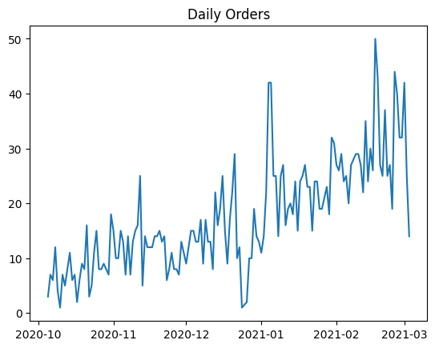
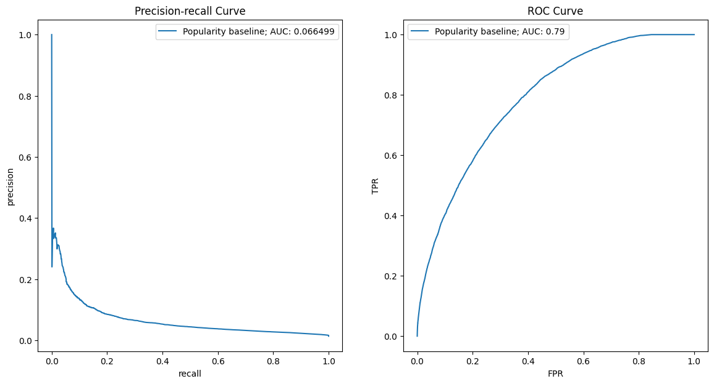
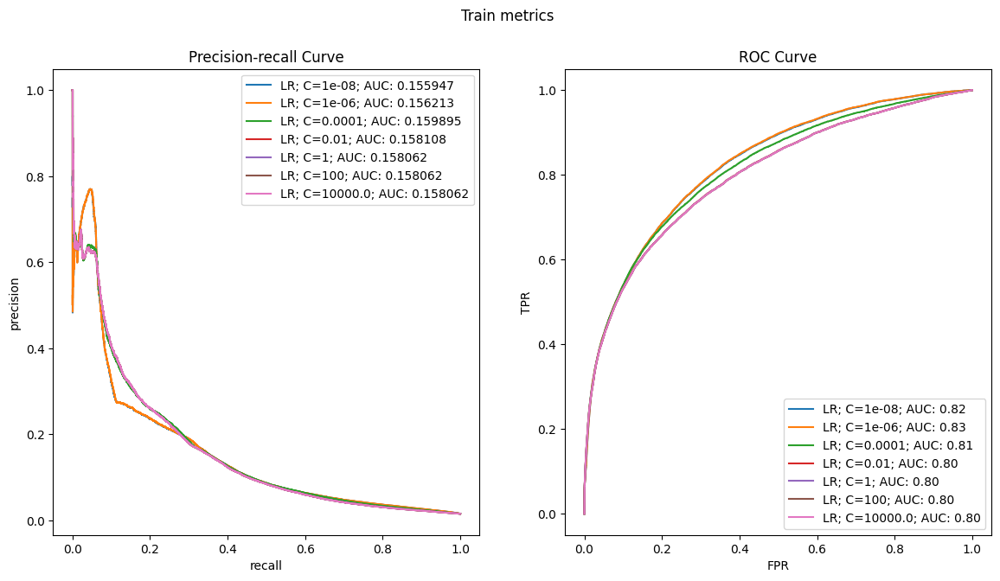
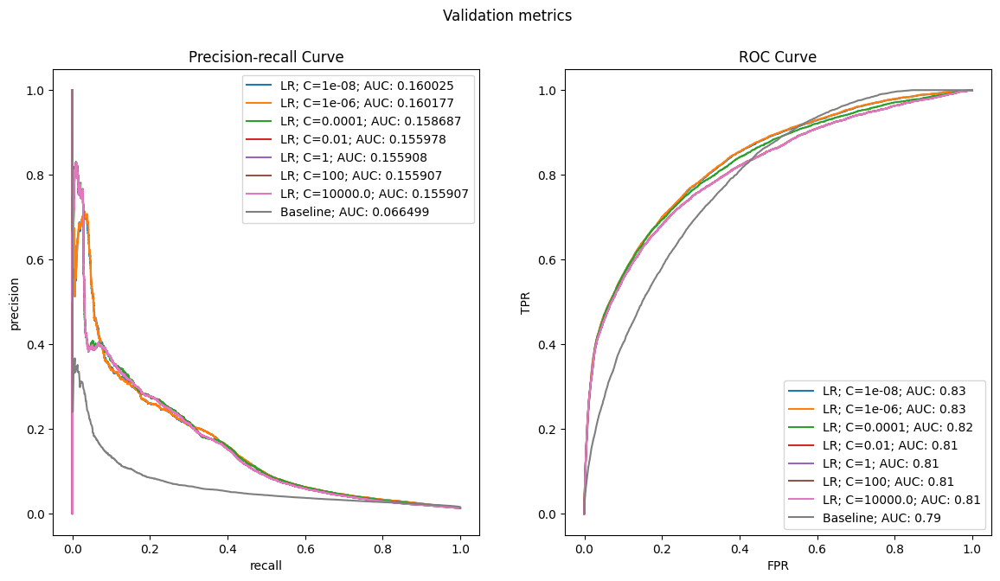
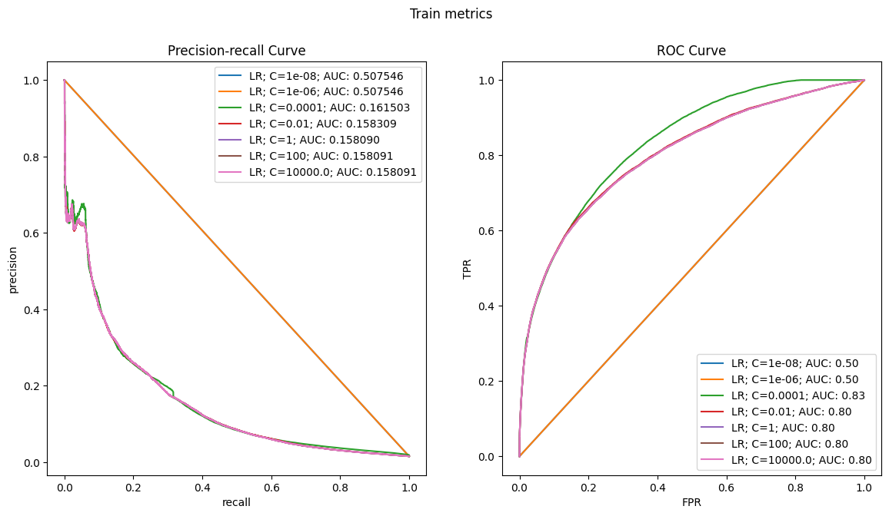
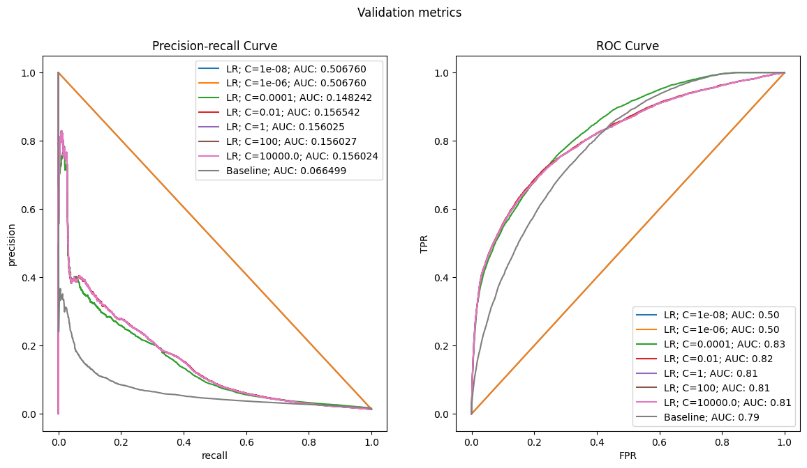
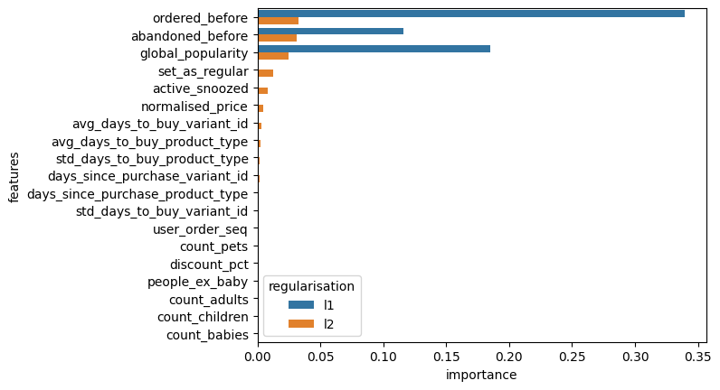
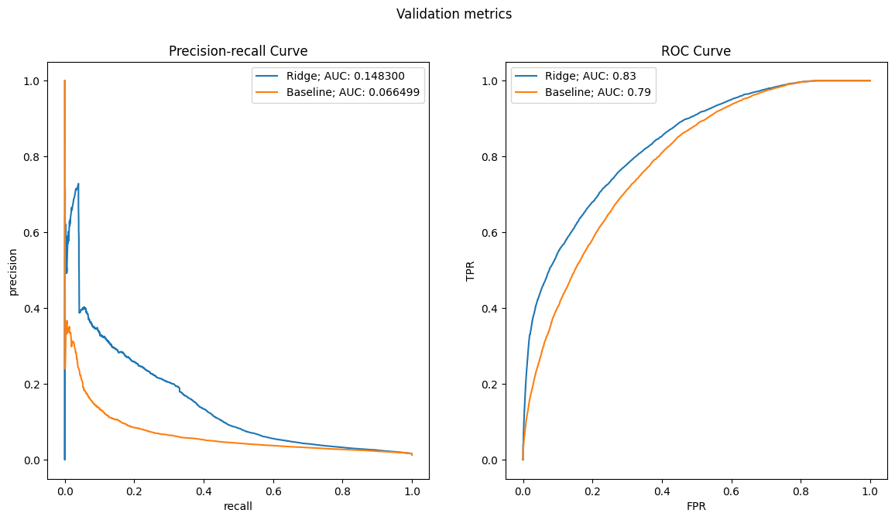
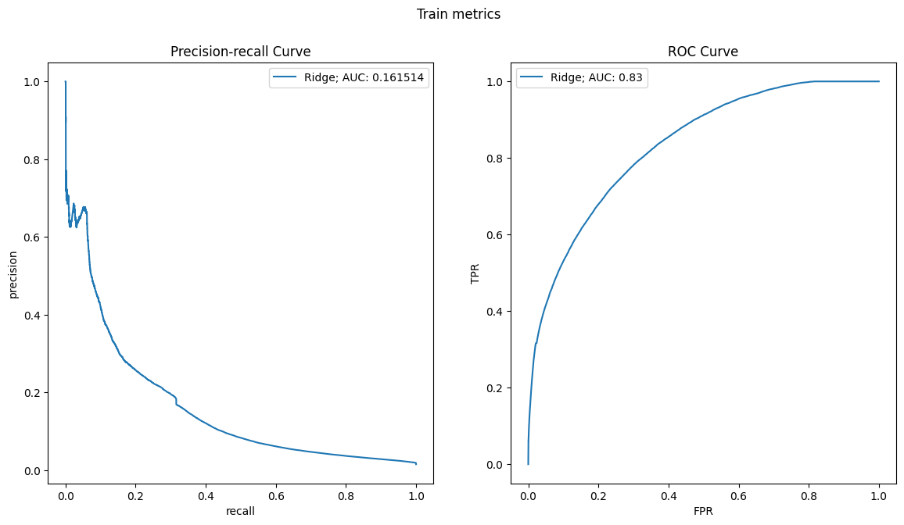
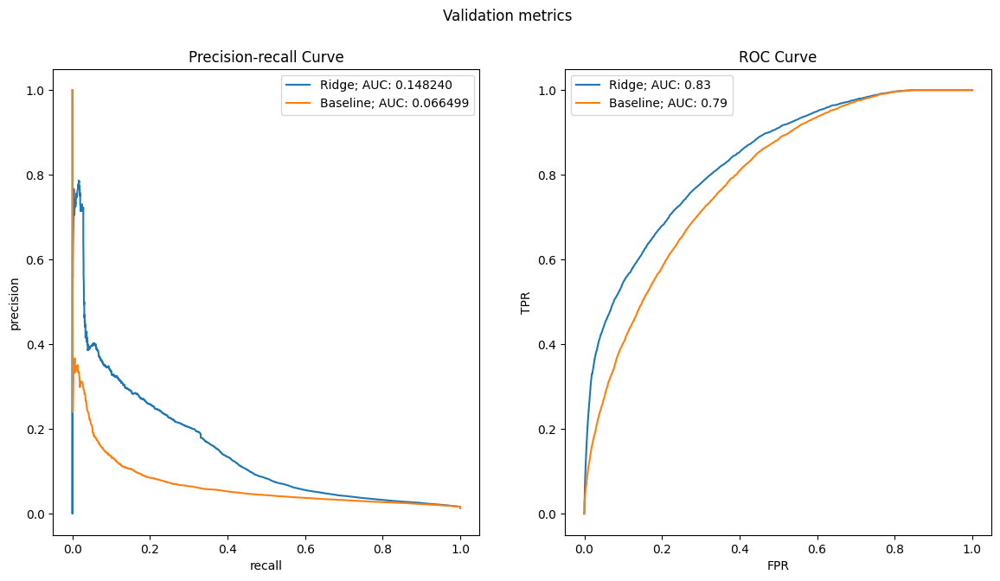

```python
import pandas as pd
import numpy as np
import matplotlib.pyplot as plt
import seaborn as sns
import matplotlib
from typing import Tuple

```


```python
from sklearn.linear_model import LogisticRegression
from sklearn.metrics import precision_recall_curve, roc_curve, roc_auc_score, auc
from sklearn.pipeline import make_pipeline, Pipeline
from sklearn.preprocessing import StandardScaler
```


```python
df = pd.read_csv(r"C:\Users\Alberto\Desktop\Zrive\zrive-ds\Data set_Modulo2\feature_frame.csv")
```


```python
df.head()
```


<div>
<style scoped>
    .dataframe tbody tr th:only-of-type {
        vertical-align: middle;
    }

    .dataframe tbody tr th {
        vertical-align: top;
    }

    .dataframe thead th {
        text-align: right;
    }
</style>
<table border="1" class="dataframe">
  <thead>
    <tr style="text-align: right;">
      <th></th>
      <th>variant_id</th>
      <th>product_type</th>
      <th>order_id</th>
      <th>user_id</th>
      <th>created_at</th>
      <th>order_date</th>
      <th>user_order_seq</th>
      <th>outcome</th>
      <th>ordered_before</th>
      <th>abandoned_before</th>
      <th>...</th>
      <th>count_children</th>
      <th>count_babies</th>
      <th>count_pets</th>
      <th>people_ex_baby</th>
      <th>days_since_purchase_variant_id</th>
      <th>avg_days_to_buy_variant_id</th>
      <th>std_days_to_buy_variant_id</th>
      <th>days_since_purchase_product_type</th>
      <th>avg_days_to_buy_product_type</th>
      <th>std_days_to_buy_product_type</th>
    </tr>
  </thead>
  <tbody>
    <tr>
      <th>0</th>
      <td>33826472919172</td>
      <td>ricepastapulses</td>
      <td>2807985930372</td>
      <td>3482464092292</td>
      <td>2020-10-05 16:46:19</td>
      <td>2020-10-05 00:00:00</td>
      <td>3</td>
      <td>0.0</td>
      <td>0.0</td>
      <td>0.0</td>
      <td>...</td>
      <td>0.0</td>
      <td>0.0</td>
      <td>0.0</td>
      <td>2.0</td>
      <td>33.0</td>
      <td>42.0</td>
      <td>31.134053</td>
      <td>30.0</td>
      <td>30.0</td>
      <td>24.27618</td>
    </tr>
    <tr>
      <th>1</th>
      <td>33826472919172</td>
      <td>ricepastapulses</td>
      <td>2808027644036</td>
      <td>3466586718340</td>
      <td>2020-10-05 17:59:51</td>
      <td>2020-10-05 00:00:00</td>
      <td>2</td>
      <td>0.0</td>
      <td>0.0</td>
      <td>0.0</td>
      <td>...</td>
      <td>0.0</td>
      <td>0.0</td>
      <td>0.0</td>
      <td>2.0</td>
      <td>33.0</td>
      <td>42.0</td>
      <td>31.134053</td>
      <td>30.0</td>
      <td>30.0</td>
      <td>24.27618</td>
    </tr>
    <tr>
      <th>2</th>
      <td>33826472919172</td>
      <td>ricepastapulses</td>
      <td>2808099078276</td>
      <td>3481384026244</td>
      <td>2020-10-05 20:08:53</td>
      <td>2020-10-05 00:00:00</td>
      <td>4</td>
      <td>0.0</td>
      <td>0.0</td>
      <td>0.0</td>
      <td>...</td>
      <td>0.0</td>
      <td>0.0</td>
      <td>0.0</td>
      <td>2.0</td>
      <td>33.0</td>
      <td>42.0</td>
      <td>31.134053</td>
      <td>30.0</td>
      <td>30.0</td>
      <td>24.27618</td>
    </tr>
    <tr>
      <th>3</th>
      <td>33826472919172</td>
      <td>ricepastapulses</td>
      <td>2808393957508</td>
      <td>3291363377284</td>
      <td>2020-10-06 08:57:59</td>
      <td>2020-10-06 00:00:00</td>
      <td>2</td>
      <td>0.0</td>
      <td>0.0</td>
      <td>0.0</td>
      <td>...</td>
      <td>0.0</td>
      <td>0.0</td>
      <td>0.0</td>
      <td>2.0</td>
      <td>33.0</td>
      <td>42.0</td>
      <td>31.134053</td>
      <td>30.0</td>
      <td>30.0</td>
      <td>24.27618</td>
    </tr>
    <tr>
      <th>4</th>
      <td>33826472919172</td>
      <td>ricepastapulses</td>
      <td>2808429314180</td>
      <td>3537167515780</td>
      <td>2020-10-06 10:37:05</td>
      <td>2020-10-06 00:00:00</td>
      <td>3</td>
      <td>0.0</td>
      <td>0.0</td>
      <td>0.0</td>
      <td>...</td>
      <td>0.0</td>
      <td>0.0</td>
      <td>0.0</td>
      <td>2.0</td>
      <td>33.0</td>
      <td>42.0</td>
      <td>31.134053</td>
      <td>30.0</td>
      <td>30.0</td>
      <td>24.27618</td>
    </tr>
  </tbody>
</table>
<p>5 rows × 27 columns</p>
</div>


```python
df.info()
```

    <class 'pandas.core.frame.DataFrame'>
    RangeIndex: 2880549 entries, 0 to 2880548
    Data columns (total 27 columns):
     #   Column                            Dtype  
    ---  ------                            -----  
     0   variant_id                        int64  
     1   product_type                      object 
     2   order_id                          int64  
     3   user_id                           int64  
     4   created_at                        object 
     5   order_date                        object 
     6   user_order_seq                    int64  
     7   outcome                           float64
     8   ordered_before                    float64
     9   abandoned_before                  float64
     10  active_snoozed                    float64
     11  set_as_regular                    float64
     12  normalised_price                  float64
     13  discount_pct                      float64
     14  vendor                            object 
     15  global_popularity                 float64
     16  count_adults                      float64
     17  count_children                    float64
     18  count_babies                      float64
     19  count_pets                        float64
     20  people_ex_baby                    float64
     21  days_since_purchase_variant_id    float64
     22  avg_days_to_buy_variant_id        float64
     23  std_days_to_buy_variant_id        float64
     24  days_since_purchase_product_type  float64
     25  avg_days_to_buy_product_type      float64
     26  std_days_to_buy_product_type      float64
    dtypes: float64(19), int64(4), object(4)
    memory usage: 593.4+ MB
    


```python
info_cols = ["variant_id","order_id","user_id","created_at","order_at"]
label_col= "outcome"
features_cols = [col for col in df.columns if col not in info_cols + [label_col]]

categorical_cols = ["product_type", "vendor"]
binary_cols = ["ordered_before", "abandoned_before", "active_snoozed", "set_as_regular"]
numerical_cols =  [
    col for col in features_cols if col not in categorical_cols + binary_cols]
```


```python
info_cols = ["variant_id", "order_id", "user_id", "created_at", "order_date"]
label_col = "outcome"
features_cols = [col for col in df.columns if col not in info_cols + [label_col]]

categorical_cols = ["product_type", "vendor"]
binary_cols = ["ordered_before", "abandoned_before", "active_snoozed", "set_as_regular"]
numerical_cols = [
    col for col in features_cols if col not in categorical_cols + binary_cols
]

```


```python
def push_relevant_dataframe(df: pd.DataFrame, min_products: int = 5) -> pd.DataFrame:
    """Only interested in order that have more than 5 products"""
    order_size = df.groupby("order_id").outcome.sum()
    order_of_min_size = order_size[order_size>= min_products].index
    return df.loc[lambda x: x.order_id.isin(order_of_min_size)]

df_selected= (
    df.pipe(push_relevant_dataframe)
    .assign(created_at=lambda x: pd.to_datetime(x.created_at))
    .assign(order_date= lambda x: pd.to_datetime(x.order_date).dt.date)
)
```


```python
df_selected.dtypes
```


    variant_id                                   int64
    product_type                                object
    order_id                                     int64
    user_id                                      int64
    created_at                          datetime64[ns]
    order_date                                  object
    user_order_seq                               int64
    outcome                                    float64
    ordered_before                             float64
    abandoned_before                           float64
    active_snoozed                             float64
    set_as_regular                             float64
    normalised_price                           float64
    discount_pct                               float64
    vendor                                      object
    global_popularity                          float64
    count_adults                               float64
    count_children                             float64
    count_babies                               float64
    count_pets                                 float64
    people_ex_baby                             float64
    days_since_purchase_variant_id             float64
    avg_days_to_buy_variant_id                 float64
    std_days_to_buy_variant_id                 float64
    days_since_purchase_product_type           float64
    avg_days_to_buy_product_type               float64
    std_days_to_buy_product_type               float64
    dtype: object


```python
df.order_id.nunique() > df_selected.order_id.nunique()
```


    True


```python
df_selected.head()
```


<div>
<style scoped>
    .dataframe tbody tr th:only-of-type {
        vertical-align: middle;
    }

    .dataframe tbody tr th {
        vertical-align: top;
    }

    .dataframe thead th {
        text-align: right;
    }
</style>
<table border="1" class="dataframe">
  <thead>
    <tr style="text-align: right;">
      <th></th>
      <th>variant_id</th>
      <th>product_type</th>
      <th>order_id</th>
      <th>user_id</th>
      <th>created_at</th>
      <th>order_date</th>
      <th>user_order_seq</th>
      <th>outcome</th>
      <th>ordered_before</th>
      <th>abandoned_before</th>
      <th>...</th>
      <th>count_children</th>
      <th>count_babies</th>
      <th>count_pets</th>
      <th>people_ex_baby</th>
      <th>days_since_purchase_variant_id</th>
      <th>avg_days_to_buy_variant_id</th>
      <th>std_days_to_buy_variant_id</th>
      <th>days_since_purchase_product_type</th>
      <th>avg_days_to_buy_product_type</th>
      <th>std_days_to_buy_product_type</th>
    </tr>
  </thead>
  <tbody>
    <tr>
      <th>0</th>
      <td>33826472919172</td>
      <td>ricepastapulses</td>
      <td>2807985930372</td>
      <td>3482464092292</td>
      <td>2020-10-05 16:46:19</td>
      <td>2020-10-05</td>
      <td>3</td>
      <td>0.0</td>
      <td>0.0</td>
      <td>0.0</td>
      <td>...</td>
      <td>0.0</td>
      <td>0.0</td>
      <td>0.0</td>
      <td>2.0</td>
      <td>33.0</td>
      <td>42.0</td>
      <td>31.134053</td>
      <td>30.0</td>
      <td>30.0</td>
      <td>24.27618</td>
    </tr>
    <tr>
      <th>1</th>
      <td>33826472919172</td>
      <td>ricepastapulses</td>
      <td>2808027644036</td>
      <td>3466586718340</td>
      <td>2020-10-05 17:59:51</td>
      <td>2020-10-05</td>
      <td>2</td>
      <td>0.0</td>
      <td>0.0</td>
      <td>0.0</td>
      <td>...</td>
      <td>0.0</td>
      <td>0.0</td>
      <td>0.0</td>
      <td>2.0</td>
      <td>33.0</td>
      <td>42.0</td>
      <td>31.134053</td>
      <td>30.0</td>
      <td>30.0</td>
      <td>24.27618</td>
    </tr>
    <tr>
      <th>2</th>
      <td>33826472919172</td>
      <td>ricepastapulses</td>
      <td>2808099078276</td>
      <td>3481384026244</td>
      <td>2020-10-05 20:08:53</td>
      <td>2020-10-05</td>
      <td>4</td>
      <td>0.0</td>
      <td>0.0</td>
      <td>0.0</td>
      <td>...</td>
      <td>0.0</td>
      <td>0.0</td>
      <td>0.0</td>
      <td>2.0</td>
      <td>33.0</td>
      <td>42.0</td>
      <td>31.134053</td>
      <td>30.0</td>
      <td>30.0</td>
      <td>24.27618</td>
    </tr>
    <tr>
      <th>3</th>
      <td>33826472919172</td>
      <td>ricepastapulses</td>
      <td>2808393957508</td>
      <td>3291363377284</td>
      <td>2020-10-06 08:57:59</td>
      <td>2020-10-06</td>
      <td>2</td>
      <td>0.0</td>
      <td>0.0</td>
      <td>0.0</td>
      <td>...</td>
      <td>0.0</td>
      <td>0.0</td>
      <td>0.0</td>
      <td>2.0</td>
      <td>33.0</td>
      <td>42.0</td>
      <td>31.134053</td>
      <td>30.0</td>
      <td>30.0</td>
      <td>24.27618</td>
    </tr>
    <tr>
      <th>5</th>
      <td>33826472919172</td>
      <td>ricepastapulses</td>
      <td>2808434524292</td>
      <td>3479090790532</td>
      <td>2020-10-06 10:50:23</td>
      <td>2020-10-06</td>
      <td>3</td>
      <td>0.0</td>
      <td>0.0</td>
      <td>0.0</td>
      <td>...</td>
      <td>0.0</td>
      <td>0.0</td>
      <td>0.0</td>
      <td>2.0</td>
      <td>33.0</td>
      <td>42.0</td>
      <td>31.134053</td>
      <td>30.0</td>
      <td>30.0</td>
      <td>24.27618</td>
    </tr>
  </tbody>
</table>
<p>5 rows × 27 columns</p>
</div>


```python
daily_orders = df_selected.groupby("order_date")
daily_orders.head()
```


<div>
<style scoped>
    .dataframe tbody tr th:only-of-type {
        vertical-align: middle;
    }

    .dataframe tbody tr th {
        vertical-align: top;
    }

    .dataframe thead th {
        text-align: right;
    }
</style>
<table border="1" class="dataframe">
  <thead>
    <tr style="text-align: right;">
      <th></th>
      <th>variant_id</th>
      <th>product_type</th>
      <th>order_id</th>
      <th>user_id</th>
      <th>created_at</th>
      <th>order_date</th>
      <th>user_order_seq</th>
      <th>outcome</th>
      <th>ordered_before</th>
      <th>abandoned_before</th>
      <th>...</th>
      <th>count_children</th>
      <th>count_babies</th>
      <th>count_pets</th>
      <th>people_ex_baby</th>
      <th>days_since_purchase_variant_id</th>
      <th>avg_days_to_buy_variant_id</th>
      <th>std_days_to_buy_variant_id</th>
      <th>days_since_purchase_product_type</th>
      <th>avg_days_to_buy_product_type</th>
      <th>std_days_to_buy_product_type</th>
    </tr>
  </thead>
  <tbody>
    <tr>
      <th>0</th>
      <td>33826472919172</td>
      <td>ricepastapulses</td>
      <td>2807985930372</td>
      <td>3482464092292</td>
      <td>2020-10-05 16:46:19</td>
      <td>2020-10-05</td>
      <td>3</td>
      <td>0.0</td>
      <td>0.0</td>
      <td>0.0</td>
      <td>...</td>
      <td>0.0</td>
      <td>0.0</td>
      <td>0.0</td>
      <td>2.0</td>
      <td>33.0</td>
      <td>42.0</td>
      <td>31.134053</td>
      <td>30.0</td>
      <td>30.0</td>
      <td>24.276180</td>
    </tr>
    <tr>
      <th>1</th>
      <td>33826472919172</td>
      <td>ricepastapulses</td>
      <td>2808027644036</td>
      <td>3466586718340</td>
      <td>2020-10-05 17:59:51</td>
      <td>2020-10-05</td>
      <td>2</td>
      <td>0.0</td>
      <td>0.0</td>
      <td>0.0</td>
      <td>...</td>
      <td>0.0</td>
      <td>0.0</td>
      <td>0.0</td>
      <td>2.0</td>
      <td>33.0</td>
      <td>42.0</td>
      <td>31.134053</td>
      <td>30.0</td>
      <td>30.0</td>
      <td>24.276180</td>
    </tr>
    <tr>
      <th>2</th>
      <td>33826472919172</td>
      <td>ricepastapulses</td>
      <td>2808099078276</td>
      <td>3481384026244</td>
      <td>2020-10-05 20:08:53</td>
      <td>2020-10-05</td>
      <td>4</td>
      <td>0.0</td>
      <td>0.0</td>
      <td>0.0</td>
      <td>...</td>
      <td>0.0</td>
      <td>0.0</td>
      <td>0.0</td>
      <td>2.0</td>
      <td>33.0</td>
      <td>42.0</td>
      <td>31.134053</td>
      <td>30.0</td>
      <td>30.0</td>
      <td>24.276180</td>
    </tr>
    <tr>
      <th>3</th>
      <td>33826472919172</td>
      <td>ricepastapulses</td>
      <td>2808393957508</td>
      <td>3291363377284</td>
      <td>2020-10-06 08:57:59</td>
      <td>2020-10-06</td>
      <td>2</td>
      <td>0.0</td>
      <td>0.0</td>
      <td>0.0</td>
      <td>...</td>
      <td>0.0</td>
      <td>0.0</td>
      <td>0.0</td>
      <td>2.0</td>
      <td>33.0</td>
      <td>42.0</td>
      <td>31.134053</td>
      <td>30.0</td>
      <td>30.0</td>
      <td>24.276180</td>
    </tr>
    <tr>
      <th>5</th>
      <td>33826472919172</td>
      <td>ricepastapulses</td>
      <td>2808434524292</td>
      <td>3479090790532</td>
      <td>2020-10-06 10:50:23</td>
      <td>2020-10-06</td>
      <td>3</td>
      <td>0.0</td>
      <td>0.0</td>
      <td>0.0</td>
      <td>...</td>
      <td>0.0</td>
      <td>0.0</td>
      <td>0.0</td>
      <td>2.0</td>
      <td>33.0</td>
      <td>42.0</td>
      <td>31.134053</td>
      <td>30.0</td>
      <td>30.0</td>
      <td>24.276180</td>
    </tr>
    <tr>
      <th>...</th>
      <td>...</td>
      <td>...</td>
      <td>...</td>
      <td>...</td>
      <td>...</td>
      <td>...</td>
      <td>...</td>
      <td>...</td>
      <td>...</td>
      <td>...</td>
      <td>...</td>
      <td>...</td>
      <td>...</td>
      <td>...</td>
      <td>...</td>
      <td>...</td>
      <td>...</td>
      <td>...</td>
      <td>...</td>
      <td>...</td>
      <td>...</td>
    </tr>
    <tr>
      <th>11768</th>
      <td>33667302359172</td>
      <td>cleaningaccessories</td>
      <td>2882526707844</td>
      <td>3852411207812</td>
      <td>2020-12-26 09:47:59</td>
      <td>2020-12-26</td>
      <td>2</td>
      <td>0.0</td>
      <td>0.0</td>
      <td>0.0</td>
      <td>...</td>
      <td>0.0</td>
      <td>0.0</td>
      <td>0.0</td>
      <td>2.0</td>
      <td>33.0</td>
      <td>36.0</td>
      <td>27.986674</td>
      <td>30.0</td>
      <td>35.0</td>
      <td>29.001400</td>
    </tr>
    <tr>
      <th>14128</th>
      <td>33667206283396</td>
      <td>fabricconditionerfreshener</td>
      <td>2814262542468</td>
      <td>3763888685188</td>
      <td>2020-10-10 20:52:08</td>
      <td>2020-10-10</td>
      <td>2</td>
      <td>0.0</td>
      <td>0.0</td>
      <td>0.0</td>
      <td>...</td>
      <td>0.0</td>
      <td>0.0</td>
      <td>0.0</td>
      <td>2.0</td>
      <td>33.0</td>
      <td>48.0</td>
      <td>31.431177</td>
      <td>30.0</td>
      <td>36.0</td>
      <td>28.588469</td>
    </tr>
    <tr>
      <th>15212</th>
      <td>33667206283396</td>
      <td>fabricconditionerfreshener</td>
      <td>2881475543172</td>
      <td>3478277488772</td>
      <td>2020-12-24 09:44:20</td>
      <td>2020-12-24</td>
      <td>8</td>
      <td>0.0</td>
      <td>0.0</td>
      <td>0.0</td>
      <td>...</td>
      <td>0.0</td>
      <td>0.0</td>
      <td>0.0</td>
      <td>2.0</td>
      <td>33.0</td>
      <td>48.0</td>
      <td>31.431177</td>
      <td>30.0</td>
      <td>36.0</td>
      <td>28.588469</td>
    </tr>
    <tr>
      <th>18273</th>
      <td>34368927957124</td>
      <td>coffee</td>
      <td>2881475543172</td>
      <td>3478277488772</td>
      <td>2020-12-24 09:44:20</td>
      <td>2020-12-24</td>
      <td>8</td>
      <td>0.0</td>
      <td>0.0</td>
      <td>0.0</td>
      <td>...</td>
      <td>0.0</td>
      <td>0.0</td>
      <td>0.0</td>
      <td>2.0</td>
      <td>33.0</td>
      <td>33.0</td>
      <td>22.013658</td>
      <td>30.0</td>
      <td>31.0</td>
      <td>24.363052</td>
    </tr>
    <tr>
      <th>23348</th>
      <td>33667185279108</td>
      <td>bathroomlimescalecleaner</td>
      <td>2814262542468</td>
      <td>3763888685188</td>
      <td>2020-10-10 20:52:08</td>
      <td>2020-10-10</td>
      <td>2</td>
      <td>0.0</td>
      <td>0.0</td>
      <td>0.0</td>
      <td>...</td>
      <td>0.0</td>
      <td>0.0</td>
      <td>0.0</td>
      <td>2.0</td>
      <td>33.0</td>
      <td>35.0</td>
      <td>26.821477</td>
      <td>30.0</td>
      <td>33.0</td>
      <td>26.873475</td>
    </tr>
  </tbody>
</table>
<p>745 rows × 27 columns</p>
</div>


```python
daily_orders = df_selected.groupby("order_date").order_id
daily_orders.head()
```


    0        2807985930372
    1        2808027644036
    2        2808099078276
    3        2808393957508
    5        2808434524292
                 ...      
    11768    2882526707844
    14128    2814262542468
    15212    2881475543172
    18273    2881475543172
    23348    2814262542468
    Name: order_id, Length: 745, dtype: int64


```python
daily_orders = df_selected.groupby("order_date").order_id.nunique()
```


```python
daily_orders.head()
```


    order_date
    2020-10-05     3
    2020-10-06     7
    2020-10-07     6
    2020-10-08    12
    2020-10-09     4
    Name: order_id, dtype: int64


```python
plt.plot(daily_orders, label = "daily orders")
plt.title("Daily Orders")
```


    Text(0.5, 1.0, 'Daily Orders')


    

    


Evolution temporal fuerte ==> Interesante hacer un split temporal, sobre todo para evitar information leakage:


```python
cumsum_daily_orders = daily_orders.cumsum() / daily_orders.sum()
cumsum_daily_orders
```


    order_date
    2020-10-05    0.001153
    2020-10-06    0.003842
    2020-10-07    0.006147
    2020-10-08    0.010757
    2020-10-09    0.012294
                    ...   
    2021-02-27    0.956589
    2021-02-28    0.968882
    2021-03-01    0.985017
    2021-03-02    0.994622
    2021-03-03    1.000000
    Name: order_id, Length: 149, dtype: float64


```python
train_val_cutoff = cumsum_daily_orders[cumsum_daily_orders <= 0.7].idxmax()
val_test_cutoff = cumsum_daily_orders[cumsum_daily_orders <= 0.9].idxmax()

print("Start:",cumsum_daily_orders.index.min())
print("End train:",train_val_cutoff)
print("End val:",val_test_cutoff)
print("End:",cumsum_daily_orders.index.max())
```

    Start: 2020-10-05
    End train: 2021-02-04
    End val: 2021-02-22
    End: 2021-03-03
    


```python
train_df = df_selected[df_selected.order_date <= train_val_cutoff]
val_df = df_selected[
    (df_selected.order_date > train_val_cutoff)
    & (df_selected.order_date <= val_test_cutoff)
]
test_df = df_selected[df_selected.order_date > val_test_cutoff]
```

# Baseline 

Use variable global popularity to predict the posibility of buying a product.

I am going to use 2 metrics ==> Precion-Recall and ROC curve


```python
def plot_metrics(
        model_name: str,
        y_pred: pd.Series,
        y_test: pd.Series,
        target_precision: float = 0.05,
        figure: Tuple[matplotlib.figure.Figure, np.array] = None,
        
): 
        precision_, recall_, _ = precision_recall_curve(y_test, y_pred)
        pr_auc = auc(recall_, precision_)

        fpr, tpr, _ = roc_curve(y_test, y_pred)
        roc_auc = roc_auc_score(y_test, y_pred)

        if figure is None:
                fig, ax = plt.subplots(1, 2, figsize = (14,7))
        else:
                fig, ax = figure

        ax[0].plot(recall_, precision_, label= f"{model_name}; AUC: {pr_auc:2f}")
        ax[0].set_xlabel("recall")
        ax[0].set_ylabel("precision")
        ax[0].set_title(f"Precision-recall Curve")
        ax[0].legend()

        ax[1].plot(fpr,tpr, label=f"{model_name}; AUC: {roc_auc:.2f}")
        ax[1].set_xlabel("FPR")
        ax[1].set_ylabel("TPR")
        ax[1].set_title(f"ROC Curve")
        ax[1].legend()


```


```python
plot_metrics(
    "Popularity baseline", y_pred= val_df["global_popularity"], y_test = val_df[label_col]
)
```


    

    


Model Training!!!!


```python
def features_label_split(
        df: pd.DataFrame, label_col: str
) -> Tuple[pd.DataFrame, pd.Series]:
    return df.drop(label_col, axis=1), df[label_col]

X_train, y_train = features_label_split(train_df, label_col)
X_val, y_val = features_label_split(val_df, label_col)
X_test, y_test = features_label_split(test_df, label_col)
```


```python
train_cols = numerical_cols + binary_cols
```

# Ridge Regression


```python
lr_push_train_aucs = []
lr_push_val_aucs = []
lr_push_train_ce = []
lr_push_val_ce = []

fig1, ax1 = plt.subplots(1, 2, figsize =(14, 7))
fig1.suptitle("Train metrics")

fig2, ax2 = plt.subplots(1, 2, figsize = (14, 7))
fig2.suptitle("Validation metrics")

cs = [1e-8, 1e-6, 1e-4, 1e-2, 1, 100, 1e4]
for c in cs:
    lr = make_pipeline(
        StandardScaler(),
        LogisticRegression(penalty= "l2", C = c if c else 1.0),
    )
    lr.fit(X_train[train_cols], y_train)
    train_proba = lr.predict_proba(X_train[train_cols])[:,1]
    plot_metrics(
        f"LR; C={c}", y_pred = train_proba, y_test = train_df[label_col], figure = (fig1, ax1)
    )

    val_proba = lr.predict_proba(X_val[train_cols])[:, 1]
    plot_metrics(
        f"LR; C={c}", y_pred=val_proba, y_test= val_df[label_col], figure=(fig2, ax2)
    )

plot_metrics(
    f"Baseline",
    y_pred= val_df["global_popularity"],
    y_test= val_df[label_col],
    figure=(fig2, ax2),
)


```


    

    


    

    


Almost same erros in train and validation so seems not to have overfitting

Large regularization seems to be better than small, even it didn't represent a big change


# Lasso Regression


```python
lr_push_train_aucs = []
lr_push_val_aucs = []
lr_push_train_ce = []
lr_push_val_ce = []

fig1, ax1 = plt.subplots(1, 2, figsize =(14, 7))
fig1.suptitle("Train metrics")

fig2, ax2 = plt.subplots(1, 2, figsize = (14, 7))
fig2.suptitle("Validation metrics")

cs = [1e-8, 1e-6, 1e-4, 1e-2, 1, 100, 1e4]
for c in cs:
    lr = make_pipeline(
        StandardScaler(),
        LogisticRegression(penalty= "l1", C = c if c else 1.0, solver = "saga"),
    )
    lr.fit(X_train[train_cols], y_train)
    train_proba = lr.predict_proba(X_train[train_cols])[:,1]
    plot_metrics(
        f"LR; C={c}", y_pred = train_proba, y_test = train_df[label_col], figure = (fig1, ax1)
    )

    val_proba = lr.predict_proba(X_val[train_cols])[:, 1]
    plot_metrics(
        f"LR; C={c}", y_pred=val_proba, y_test= val_df[label_col], figure=(fig2, ax2)
    )

plot_metrics(
    f"Baseline",
    y_pred= val_df["global_popularity"],
    y_test= val_df[label_col],
    figure=(fig2, ax2),
)

```


    

    


    

    


Large regularisation make the model working as random. Precision recall only have 2 points in the curve, 0 or 1 so it is wrong.

Letting this apart, regularisation doesn't seem to make an impact

Similar performance as Ridge

# Coefficients weights


```python
lr = Pipeline(
    [
        ("standar_scaler", StandardScaler()),
        ("lr", LogisticRegression(penalty="l2", C=1e-6)),
    ]
)
lr.fit(X_train[train_cols], y_train)
lr_coeff_l2= pd.DataFrame(
    {
        "features": train_cols,
        "importance": np.abs(lr.named_steps["lr"].coef_[0]),
        "regularisation": ["l2"]* len(train_cols),
    }
)
lr_coeff_l2 = lr_coeff_l2.sort_values("importance", ascending=True)

lr = Pipeline(
    [
        ("standar_scaler", StandardScaler()),
        ("lr", LogisticRegression(penalty="l1", C=1e-4, solver="saga")),
    ]
)
lr.fit(X_train[train_cols], y_train)
lr_coeff_l1= pd.DataFrame(
    {
        "features": train_cols,
        "importance": np.abs(lr.named_steps["lr"].coef_[0]),
        "regularisation": "l1",
    }
)
lr_coeff_l1 = lr_coeff_l1.sort_values("importance", ascending=True)
```


```python
lr_coeffs = pd.concat([lr_coeff_l2, lr_coeff_l1])
lr_coeffs["features"] = pd.Categorical(lr_coeffs["features"])
lr_coeffs = lr_coeffs.sort_values(by = ["importance"])
order_columns = lr_coeff_l2.sort_values(by="importance", ascending=False)["features"]
sns.barplot(
    data = lr_coeffs,
    x= "importance",
    y = "features",
    hue= "regularisation",
    order = order_columns,
)
```


    <Axes: xlabel='importance', ylabel='features'>


    

    


### Train new model only with the first 3 features


```python
reduced_cols = ["ordered_before", "abandoned_before", "global_popularity"]
```

Ridge regresion


```python
fig1, ax1 = plt.subplots(1, 2, figsize =(14, 7))
fig1.suptitle("Train metrics")

fig2, ax2 = plt.subplots(1, 2, figsize = (14, 7))
fig2.suptitle("Validation metrics")

lr2 = make_pipeline(
    StandardScaler(),
    LogisticRegression(penalty= "l2", C = 1e-6),
)
lr2.fit(X_train[reduced_cols], y_train)
train_proba = lr2.predict_proba(X_train[reduced_cols])[:,1]

plot_metrics(
    f"Ridge", y_pred = train_proba, y_test = train_df[label_col], figure = (fig1, ax1)
)

val_proba = lr2.predict_proba(X_val[reduced_cols])[:, 1]

plot_metrics(
    f"Ridge", y_pred=val_proba, y_test= val_df[label_col], figure = (fig2, ax2)
)

plot_metrics(
    f"Baseline",
    y_pred= val_df["global_popularity"],
    y_test= val_df[label_col],
    figure=(fig2, ax2),
)
```


    

    


    

    


Lasso Regression


```python
fig1, ax1 = plt.subplots(1, 2, figsize =(14, 7))
fig1.suptitle("Train metrics")

fig2, ax2 = plt.subplots(1, 2, figsize = (14, 7))
fig2.suptitle("Validation metrics")

lr2 = make_pipeline(
    StandardScaler(),
    LogisticRegression(penalty= "l1", C = 1e-4, solver="saga"),
)
lr2.fit(X_train[reduced_cols], y_train)
train_proba = lr2.predict_proba(X_train[reduced_cols])[:,1]

plot_metrics(
    f"Ridge", y_pred = train_proba, y_test = train_df[label_col], figure = (fig1, ax1)
)

val_proba = lr2.predict_proba(X_val[reduced_cols])[:, 1]

plot_metrics(
    f"Ridge", y_pred=val_proba, y_test= val_df[label_col], figure = (fig2, ax2)
)

plot_metrics(
    f"Baseline",
    y_pred= val_df["global_popularity"],
    y_test= val_df[label_col],
    figure=(fig2, ax2),
)
```


    

    


    

    


## Results

Ridge and lasso are better than the baseline


```python

```
