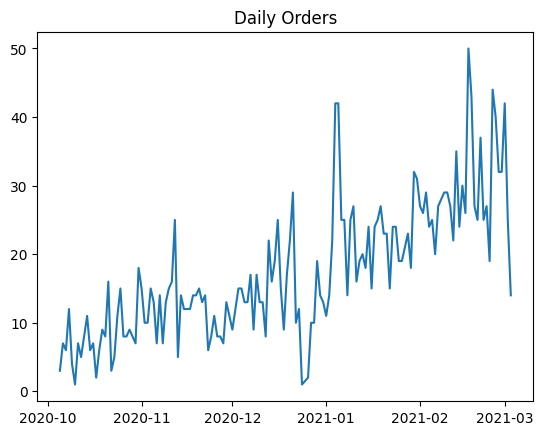
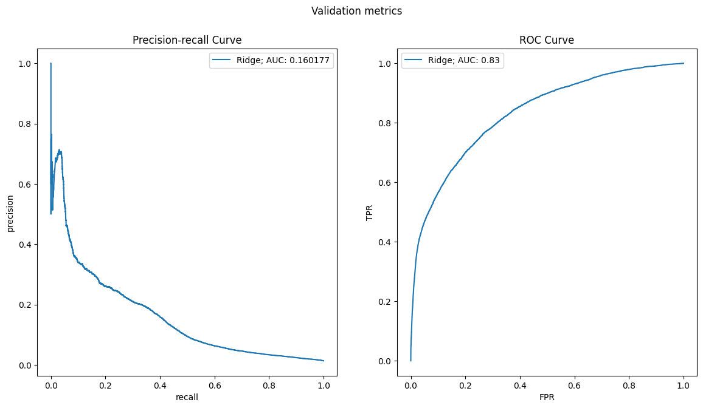
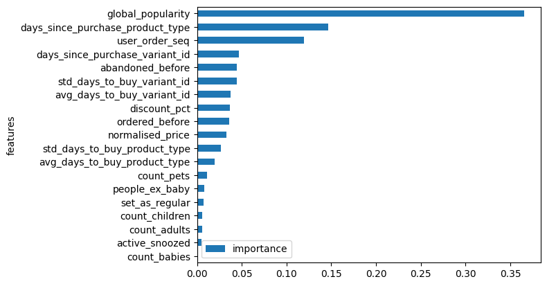
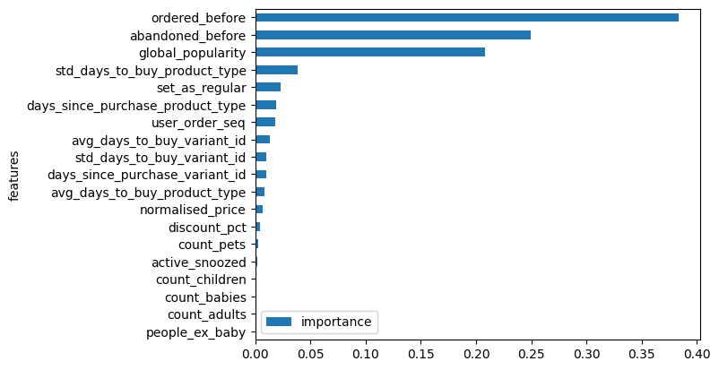

```python
import pandas as pd
import numpy as np
import matplotlib.pyplot as plt
import seaborn as sns
import matplotlib
from typing import Tuple
```


```python
from sklearn.linear_model import LogisticRegression
from sklearn.metrics import precision_recall_curve, roc_curve, roc_auc_score, auc
from sklearn.pipeline import make_pipeline, Pipeline
from sklearn.preprocessing import StandardScaler
```


```python
from pathlib import Path
from sklearn.calibration import calibration_curve, CalibratedClassifierCV
from sklearn.ensemble import GradientBoostingClassifier, RandomForestClassifier
from sklearn.metrics import (
    average_precision_score,
    log_loss,
    precision_recall_fscore_support,
)
from sklearn.model_selection import GridSearchCV
```

# Upload Data and Analysis

### Exactly the same thing than module_3 so I will not stop to much in this part.

### Focuse will be but on the model fitting part, with non linear models


```python
BASE_PATH = r"C:\Users\Alberto\Desktop\Zrive\zrive-ds\Data set_Modulo2"
download_path=f"{BASE_PATH}/feature_frame.csv"
df = pd.read_csv(download_path)
```


```python
df.head()
```


<div>
<style scoped>
    .dataframe tbody tr th:only-of-type {
        vertical-align: middle;
    }

    .dataframe tbody tr th {
        vertical-align: top;
    }

    .dataframe thead th {
        text-align: right;
    }
</style>
<table border="1" class="dataframe">
  <thead>
    <tr style="text-align: right;">
      <th></th>
      <th>variant_id</th>
      <th>product_type</th>
      <th>order_id</th>
      <th>user_id</th>
      <th>created_at</th>
      <th>order_date</th>
      <th>user_order_seq</th>
      <th>outcome</th>
      <th>ordered_before</th>
      <th>abandoned_before</th>
      <th>...</th>
      <th>count_children</th>
      <th>count_babies</th>
      <th>count_pets</th>
      <th>people_ex_baby</th>
      <th>days_since_purchase_variant_id</th>
      <th>avg_days_to_buy_variant_id</th>
      <th>std_days_to_buy_variant_id</th>
      <th>days_since_purchase_product_type</th>
      <th>avg_days_to_buy_product_type</th>
      <th>std_days_to_buy_product_type</th>
    </tr>
  </thead>
  <tbody>
    <tr>
      <th>0</th>
      <td>33826472919172</td>
      <td>ricepastapulses</td>
      <td>2807985930372</td>
      <td>3482464092292</td>
      <td>2020-10-05 16:46:19</td>
      <td>2020-10-05 00:00:00</td>
      <td>3</td>
      <td>0.0</td>
      <td>0.0</td>
      <td>0.0</td>
      <td>...</td>
      <td>0.0</td>
      <td>0.0</td>
      <td>0.0</td>
      <td>2.0</td>
      <td>33.0</td>
      <td>42.0</td>
      <td>31.134053</td>
      <td>30.0</td>
      <td>30.0</td>
      <td>24.27618</td>
    </tr>
    <tr>
      <th>1</th>
      <td>33826472919172</td>
      <td>ricepastapulses</td>
      <td>2808027644036</td>
      <td>3466586718340</td>
      <td>2020-10-05 17:59:51</td>
      <td>2020-10-05 00:00:00</td>
      <td>2</td>
      <td>0.0</td>
      <td>0.0</td>
      <td>0.0</td>
      <td>...</td>
      <td>0.0</td>
      <td>0.0</td>
      <td>0.0</td>
      <td>2.0</td>
      <td>33.0</td>
      <td>42.0</td>
      <td>31.134053</td>
      <td>30.0</td>
      <td>30.0</td>
      <td>24.27618</td>
    </tr>
    <tr>
      <th>2</th>
      <td>33826472919172</td>
      <td>ricepastapulses</td>
      <td>2808099078276</td>
      <td>3481384026244</td>
      <td>2020-10-05 20:08:53</td>
      <td>2020-10-05 00:00:00</td>
      <td>4</td>
      <td>0.0</td>
      <td>0.0</td>
      <td>0.0</td>
      <td>...</td>
      <td>0.0</td>
      <td>0.0</td>
      <td>0.0</td>
      <td>2.0</td>
      <td>33.0</td>
      <td>42.0</td>
      <td>31.134053</td>
      <td>30.0</td>
      <td>30.0</td>
      <td>24.27618</td>
    </tr>
    <tr>
      <th>3</th>
      <td>33826472919172</td>
      <td>ricepastapulses</td>
      <td>2808393957508</td>
      <td>3291363377284</td>
      <td>2020-10-06 08:57:59</td>
      <td>2020-10-06 00:00:00</td>
      <td>2</td>
      <td>0.0</td>
      <td>0.0</td>
      <td>0.0</td>
      <td>...</td>
      <td>0.0</td>
      <td>0.0</td>
      <td>0.0</td>
      <td>2.0</td>
      <td>33.0</td>
      <td>42.0</td>
      <td>31.134053</td>
      <td>30.0</td>
      <td>30.0</td>
      <td>24.27618</td>
    </tr>
    <tr>
      <th>4</th>
      <td>33826472919172</td>
      <td>ricepastapulses</td>
      <td>2808429314180</td>
      <td>3537167515780</td>
      <td>2020-10-06 10:37:05</td>
      <td>2020-10-06 00:00:00</td>
      <td>3</td>
      <td>0.0</td>
      <td>0.0</td>
      <td>0.0</td>
      <td>...</td>
      <td>0.0</td>
      <td>0.0</td>
      <td>0.0</td>
      <td>2.0</td>
      <td>33.0</td>
      <td>42.0</td>
      <td>31.134053</td>
      <td>30.0</td>
      <td>30.0</td>
      <td>24.27618</td>
    </tr>
  </tbody>
</table>
<p>5 rows × 27 columns</p>
</div>


```python
info_cols = ["variant_id", "order_id", "user_id", "created_at", "order_date"]
label_col = "outcome"
features_cols = [col for col in df.columns if col not in info_cols + [label_col]]

categorical_cols = ["product_type", "vendor"]
binary_cols = ["ordered_before", "abandoned_before", "active_snoozed", "set_as_regular"]
numerical_cols = [
    col for col in features_cols if col not in categorical_cols + binary_cols
]

```


```python
def push_relevant_dataframe(df: pd.DataFrame, min_products: int = 5) -> pd.DataFrame:
    """Only interested in order that have more than 5 products"""
    order_size = df.groupby("order_id").outcome.sum()
    order_of_min_size = order_size[order_size>= min_products].index
    return df.loc[lambda x: x.order_id.isin(order_of_min_size)]

df_selected= (
    df.pipe(push_relevant_dataframe)
    .assign(created_at=lambda x: pd.to_datetime(x.created_at))
    .assign(order_date= lambda x: pd.to_datetime(x.order_date).dt.date)
)
```


```python
df_selected.dtypes
```


    variant_id                                   int64
    product_type                                object
    order_id                                     int64
    user_id                                      int64
    created_at                          datetime64[ns]
    order_date                                  object
    user_order_seq                               int64
    outcome                                    float64
    ordered_before                             float64
    abandoned_before                           float64
    active_snoozed                             float64
    set_as_regular                             float64
    normalised_price                           float64
    discount_pct                               float64
    vendor                                      object
    global_popularity                          float64
    count_adults                               float64
    count_children                             float64
    count_babies                               float64
    count_pets                                 float64
    people_ex_baby                             float64
    days_since_purchase_variant_id             float64
    avg_days_to_buy_variant_id                 float64
    std_days_to_buy_variant_id                 float64
    days_since_purchase_product_type           float64
    avg_days_to_buy_product_type               float64
    std_days_to_buy_product_type               float64
    dtype: object


```python
df.order_id.nunique() > df_selected.order_id.nunique()
```


    True


```python
daily_orders = df_selected.groupby("order_date").order_id.nunique()
plt.plot(daily_orders, label = "daily orders")
plt.title("Daily Orders")
```


    Text(0.5, 1.0, 'Daily Orders')


    

    


```python
cumsum_daily_orders = daily_orders.cumsum() / daily_orders.sum()
cumsum_daily_orders
```


    order_date
    2020-10-05    0.001153
    2020-10-06    0.003842
    2020-10-07    0.006147
    2020-10-08    0.010757
    2020-10-09    0.012294
                    ...   
    2021-02-27    0.956589
    2021-02-28    0.968882
    2021-03-01    0.985017
    2021-03-02    0.994622
    2021-03-03    1.000000
    Name: order_id, Length: 149, dtype: float64


```python
train_val_cutoff = cumsum_daily_orders[cumsum_daily_orders <= 0.7].idxmax()
val_test_cutoff = cumsum_daily_orders[cumsum_daily_orders <= 0.9].idxmax()

print("Start:",cumsum_daily_orders.index.min())
print("End train:",train_val_cutoff)
print("End val:",val_test_cutoff)
print("End:",cumsum_daily_orders.index.max())
```

    Start: 2020-10-05
    End train: 2021-02-04
    End val: 2021-02-22
    End: 2021-03-03
    


```python
train_df = df_selected[df_selected.order_date <= train_val_cutoff]
val_df = df_selected[
    (df_selected.order_date > train_val_cutoff)
    & (df_selected.order_date <= val_test_cutoff)
]
test_df = df_selected[df_selected.order_date > val_test_cutoff]
```

## Until here I have the dataset divided in train (70%), validation (20%) and test (10%)

Exactly the same as the last module

# Baseline

### For the baseline we use the Rigde regression of the module 3, with 1e-6 as C for regularisation


```python
def plot_metrics(
        model_name: str,
        y_pred: pd.Series,
        y_test: pd.Series,
        target_precision: float = 0.05,
        figure: Tuple[matplotlib.figure.Figure, np.array] = None,
        
): 
        precision_, recall_, _ = precision_recall_curve(y_test, y_pred)
        pr_auc = auc(recall_, precision_)

        fpr, tpr, _ = roc_curve(y_test, y_pred)
        roc_auc = roc_auc_score(y_test, y_pred)

        if figure is None:
                fig, ax = plt.subplots(1, 2, figsize = (14,7))
        else:
                fig, ax = figure

        ax[0].plot(recall_, precision_, label= f"{model_name}; AUC: {pr_auc:2f}")
        ax[0].set_xlabel("recall")
        ax[0].set_ylabel("precision")
        ax[0].set_title(f"Precision-recall Curve")
        ax[0].legend()

        ax[1].plot(fpr,tpr, label=f"{model_name}; AUC: {roc_auc:.2f}")
        ax[1].set_xlabel("FPR")
        ax[1].set_ylabel("TPR")
        ax[1].set_title(f"ROC Curve")
        ax[1].legend()
```


```python
def features_label_split(
        df: pd.DataFrame, label_col: str
) -> Tuple[pd.DataFrame, pd.Series]:
    return df.drop(label_col, axis=1), df[label_col]

X_train, y_train = features_label_split(train_df, label_col)
X_val, y_val = features_label_split(val_df, label_col)
X_test, y_test = features_label_split(test_df, label_col)
```

I am going to try to create a function to evaluate the configuration of the model so i can use it each time I train a model

Function to evaluate the metrics AUC, Precision recall y crossentropy


```python
def evaluate_configuration(
    clf,
    X_train,
    y_train,
    X_val,
    y_val,
    train_aucs_list,
    val_aucs_list,
    train_ce_list,
    val_ce_list,
    train_aps_list,
    val_aps_list,
):
    val_preds = clf.predict_proba(X_val)[:, 1]
    train_preds = clf.predict_proba(X_train)[:, 1]
    train_auc = roc_auc_score(y_train, train_preds)
    val_auc = roc_auc_score(y_val, val_preds)

    train_crossentropy = log_loss(y_train, train_preds)
    val_crossentropy = log_loss(y_val, val_preds)

    train_ap = average_precision_score(y_train, train_preds)
    val_ap = average_precision_score(y_val, val_preds)

    train_aucs_list.append(train_auc)
    val_aucs_list.append(val_auc)
    train_ce_list.append(train_crossentropy)
    val_ce_list.append(val_crossentropy)
    train_aps_list.append(train_ap)
    val_aps_list.append(val_ap)

```


```python
def plot_feature_importance(clf, columns):
    fig, ax = plt.subplots()
    fi = pd.DataFrame(
        list(zip(columns, clf.feature_importances_)), columns = ["features", "importance"]
    ).sort_values(by= "importance", ascending=True)
    fi.plot(kind = "barh",x = "features", y = "importance", ax = ax)
    return fi, fig, ax
```


```python
columns = numerical_cols + binary_cols
```


```python
lr_push_train_aucs =  []
lr_push_val_aucs =  []
lr_push_train_ce =  []
lr_push_val_ce =  []
lr_push_train_aps=  []
lr_push_val_aps =  []

lr = make_pipeline(
    StandardScaler(),
    LogisticRegression(penalty= "l2", C=1e-6),
)

lr.fit(X_train[columns], y_train)

evaluate_configuration(
    lr,
    X_train[columns],
    y_train,
    X_val[columns],
    y_val,
    lr_push_train_aucs,
    lr_push_val_aucs,
    lr_push_train_ce,
    lr_push_val_ce,
    lr_push_train_aps,
    lr_push_val_aps,
)

```


```python
print(
    f"C: 1e-6 done with train auc: {lr_push_train_aucs[-1]:.4f} and val auc: {lr_push_val_aucs[-1]:.4f}. "
    f"AP train: {lr_push_train_aps[-1]:.4f} and val: {lr_push_val_aps[-1]:.4f}. "
    f"Cross entropy train: {lr_push_train_ce[-1]:.4f}, val: {lr_push_val_ce[-1]:.4f}."
)

```

    C: 1e-6 done with train auc: 0.8254 and val auc: 0.8326. AP train: 0.1562 and val: 0.1603. Cross entropy train: 0.0762, val: 0.0694.
    


```python
val_preds = lr.predict_proba(X_val[columns])[:, 1]

fig2, ax2 = plt.subplots(1, 2, figsize = (14, 7))
fig2.suptitle("Validation metrics")

plot_metrics(
    f"Ridge", y_pred=val_preds, y_test= val_df[label_col], figure = (fig2, ax2)
)
```


    

    


 Charts of Precision recall and AUC

# Model fitting ==> Non linear 

### Random Forest


```python
n_trees_grid = [5, 25, 50, 100]

rf_push_train_aucs = []
rf_push_val_aucs = []

rf_push_train_ce = []
rf_push_val_ce = []

rf_push_train_aps = []
rf_push_val_aps = []

for n_trees in n_trees_grid:
    rf = RandomForestClassifier(n_trees)
    rf.fit(X_train[columns], y_train)

```


```python
n_trees_grid = [5, 25, 50, 100]

rf_push_train_aucs = []
rf_push_val_aucs = []

rf_push_train_ce = []
rf_push_val_ce = []

rf_push_train_aps = []
rf_push_val_aps = []

for n_trees in n_trees_grid:
    rf = RandomForestClassifier(n_trees)
    rf.fit(X_train[columns], y_train)
    evaluate_configuration(
        rf,
        X_train[columns],
        y_train,
        X_val[columns],
        y_val,
        rf_push_train_aucs,
        rf_push_val_aucs,
        rf_push_train_ce,
        rf_push_val_ce,
        rf_push_train_aps,
        rf_push_val_aps,
    )
    print(
        f"# Trees: {n_trees} done with train auc: {rf_push_train_aucs[-1]:.4f} and val auc: {rf_push_val_aucs[-1]:.4f}. "
        f"AP train: {rf_push_train_aps[-1]:.4f} and val: {rf_push_val_aps[-1]:.4f}. "
        f"Cross entropy train: {rf_push_train_ce[-1]:.4f}, val: {rf_push_val_ce[-1]:.4f}"
)

```

    # Trees: 5 done with train auc: 0.9904 and val auc: 0.6511. AP train: 0.7715 and val: 0.0749. Cross entropy train: 0.0247, val: 0.3401
    # Trees: 25 done with train auc: 0.9952 and val auc: 0.7147. AP train: 0.8517 and val: 0.1135. Cross entropy train: 0.0209, val: 0.2486
    # Trees: 50 done with train auc: 0.9955 and val auc: 0.7316. AP train: 0.8594 and val: 0.1193. Cross entropy train: 0.0208, val: 0.2196
    # Trees: 100 done with train auc: 0.9957 and val auc: 0.7509. AP train: 0.8626 and val: 0.1255. Cross entropy train: 0.0207, val: 0.1863
    

Ramdon forest first observation, AUC in train is not 100% even if for random forest we are creating the trees until the end so it should be 100%. That means that we have lines with exactly the same value on the variables but at the end the output is different.

The random forest that seems to work better is the one with 100 trees.


```python
rf = RandomForestClassifier(100)
rf.fit(X_train[columns], y_train)
```


<style>#sk-container-id-2 {
  /* Definition of color scheme common for light and dark mode */
  --sklearn-color-text: black;
  --sklearn-color-line: gray;
  /* Definition of color scheme for unfitted estimators */
  --sklearn-color-unfitted-level-0: #fff5e6;
  --sklearn-color-unfitted-level-1: #f6e4d2;
  --sklearn-color-unfitted-level-2: #ffe0b3;
  --sklearn-color-unfitted-level-3: chocolate;
  /* Definition of color scheme for fitted estimators */
  --sklearn-color-fitted-level-0: #f0f8ff;
  --sklearn-color-fitted-level-1: #d4ebff;
  --sklearn-color-fitted-level-2: #b3dbfd;
  --sklearn-color-fitted-level-3: cornflowerblue;

  /* Specific color for light theme */
  --sklearn-color-text-on-default-background: var(--sg-text-color, var(--theme-code-foreground, var(--jp-content-font-color1, black)));
  --sklearn-color-background: var(--sg-background-color, var(--theme-background, var(--jp-layout-color0, white)));
  --sklearn-color-border-box: var(--sg-text-color, var(--theme-code-foreground, var(--jp-content-font-color1, black)));
  --sklearn-color-icon: #696969;

  @media (prefers-color-scheme: dark) {
    /* Redefinition of color scheme for dark theme */
    --sklearn-color-text-on-default-background: var(--sg-text-color, var(--theme-code-foreground, var(--jp-content-font-color1, white)));
    --sklearn-color-background: var(--sg-background-color, var(--theme-background, var(--jp-layout-color0, #111)));
    --sklearn-color-border-box: var(--sg-text-color, var(--theme-code-foreground, var(--jp-content-font-color1, white)));
    --sklearn-color-icon: #878787;
  }
}

#sk-container-id-2 {
  color: var(--sklearn-color-text);
}

#sk-container-id-2 pre {
  padding: 0;
}

#sk-container-id-2 input.sk-hidden--visually {
  border: 0;
  clip: rect(1px 1px 1px 1px);
  clip: rect(1px, 1px, 1px, 1px);
  height: 1px;
  margin: -1px;
  overflow: hidden;
  padding: 0;
  position: absolute;
  width: 1px;
}

#sk-container-id-2 div.sk-dashed-wrapped {
  border: 1px dashed var(--sklearn-color-line);
  margin: 0 0.4em 0.5em 0.4em;
  box-sizing: border-box;
  padding-bottom: 0.4em;
  background-color: var(--sklearn-color-background);
}

#sk-container-id-2 div.sk-container {
  /* jupyter's `normalize.less` sets `[hidden] { display: none; }`
     but bootstrap.min.css set `[hidden] { display: none !important; }`
     so we also need the `!important` here to be able to override the
     default hidden behavior on the sphinx rendered scikit-learn.org.
     See: https://github.com/scikit-learn/scikit-learn/issues/21755 */
  display: inline-block !important;
  position: relative;
}

#sk-container-id-2 div.sk-text-repr-fallback {
  display: none;
}

div.sk-parallel-item,
div.sk-serial,
div.sk-item {
  /* draw centered vertical line to link estimators */
  background-image: linear-gradient(var(--sklearn-color-text-on-default-background), var(--sklearn-color-text-on-default-background));
  background-size: 2px 100%;
  background-repeat: no-repeat;
  background-position: center center;
}

/* Parallel-specific style estimator block */

#sk-container-id-2 div.sk-parallel-item::after {
  content: "";
  width: 100%;
  border-bottom: 2px solid var(--sklearn-color-text-on-default-background);
  flex-grow: 1;
}

#sk-container-id-2 div.sk-parallel {
  display: flex;
  align-items: stretch;
  justify-content: center;
  background-color: var(--sklearn-color-background);
  position: relative;
}

#sk-container-id-2 div.sk-parallel-item {
  display: flex;
  flex-direction: column;
}

#sk-container-id-2 div.sk-parallel-item:first-child::after {
  align-self: flex-end;
  width: 50%;
}

#sk-container-id-2 div.sk-parallel-item:last-child::after {
  align-self: flex-start;
  width: 50%;
}

#sk-container-id-2 div.sk-parallel-item:only-child::after {
  width: 0;
}

/* Serial-specific style estimator block */

#sk-container-id-2 div.sk-serial {
  display: flex;
  flex-direction: column;
  align-items: center;
  background-color: var(--sklearn-color-background);
  padding-right: 1em;
  padding-left: 1em;
}


/* Toggleable style: style used for estimator/Pipeline/ColumnTransformer box that is
clickable and can be expanded/collapsed.
- Pipeline and ColumnTransformer use this feature and define the default style
- Estimators will overwrite some part of the style using the `sk-estimator` class
*/

/* Pipeline and ColumnTransformer style (default) */

#sk-container-id-2 div.sk-toggleable {
  /* Default theme specific background. It is overwritten whether we have a
  specific estimator or a Pipeline/ColumnTransformer */
  background-color: var(--sklearn-color-background);
}

/* Toggleable label */
#sk-container-id-2 label.sk-toggleable__label {
  cursor: pointer;
  display: block;
  width: 100%;
  margin-bottom: 0;
  padding: 0.5em;
  box-sizing: border-box;
  text-align: center;
}

#sk-container-id-2 label.sk-toggleable__label-arrow:before {
  /* Arrow on the left of the label */
  content: "▸";
  float: left;
  margin-right: 0.25em;
  color: var(--sklearn-color-icon);
}

#sk-container-id-2 label.sk-toggleable__label-arrow:hover:before {
  color: var(--sklearn-color-text);
}

/* Toggleable content - dropdown */

#sk-container-id-2 div.sk-toggleable__content {
  max-height: 0;
  max-width: 0;
  overflow: hidden;
  text-align: left;
  /* unfitted */
  background-color: var(--sklearn-color-unfitted-level-0);
}

#sk-container-id-2 div.sk-toggleable__content.fitted {
  /* fitted */
  background-color: var(--sklearn-color-fitted-level-0);
}

#sk-container-id-2 div.sk-toggleable__content pre {
  margin: 0.2em;
  border-radius: 0.25em;
  color: var(--sklearn-color-text);
  /* unfitted */
  background-color: var(--sklearn-color-unfitted-level-0);
}

#sk-container-id-2 div.sk-toggleable__content.fitted pre {
  /* unfitted */
  background-color: var(--sklearn-color-fitted-level-0);
}

#sk-container-id-2 input.sk-toggleable__control:checked~div.sk-toggleable__content {
  /* Expand drop-down */
  max-height: 200px;
  max-width: 100%;
  overflow: auto;
}

#sk-container-id-2 input.sk-toggleable__control:checked~label.sk-toggleable__label-arrow:before {
  content: "▾";
}

/* Pipeline/ColumnTransformer-specific style */

#sk-container-id-2 div.sk-label input.sk-toggleable__control:checked~label.sk-toggleable__label {
  color: var(--sklearn-color-text);
  background-color: var(--sklearn-color-unfitted-level-2);
}

#sk-container-id-2 div.sk-label.fitted input.sk-toggleable__control:checked~label.sk-toggleable__label {
  background-color: var(--sklearn-color-fitted-level-2);
}

/* Estimator-specific style */

/* Colorize estimator box */
#sk-container-id-2 div.sk-estimator input.sk-toggleable__control:checked~label.sk-toggleable__label {
  /* unfitted */
  background-color: var(--sklearn-color-unfitted-level-2);
}

#sk-container-id-2 div.sk-estimator.fitted input.sk-toggleable__control:checked~label.sk-toggleable__label {
  /* fitted */
  background-color: var(--sklearn-color-fitted-level-2);
}

#sk-container-id-2 div.sk-label label.sk-toggleable__label,
#sk-container-id-2 div.sk-label label {
  /* The background is the default theme color */
  color: var(--sklearn-color-text-on-default-background);
}

/* On hover, darken the color of the background */
#sk-container-id-2 div.sk-label:hover label.sk-toggleable__label {
  color: var(--sklearn-color-text);
  background-color: var(--sklearn-color-unfitted-level-2);
}

/* Label box, darken color on hover, fitted */
#sk-container-id-2 div.sk-label.fitted:hover label.sk-toggleable__label.fitted {
  color: var(--sklearn-color-text);
  background-color: var(--sklearn-color-fitted-level-2);
}

/* Estimator label */

#sk-container-id-2 div.sk-label label {
  font-family: monospace;
  font-weight: bold;
  display: inline-block;
  line-height: 1.2em;
}

#sk-container-id-2 div.sk-label-container {
  text-align: center;
}

/* Estimator-specific */
#sk-container-id-2 div.sk-estimator {
  font-family: monospace;
  border: 1px dotted var(--sklearn-color-border-box);
  border-radius: 0.25em;
  box-sizing: border-box;
  margin-bottom: 0.5em;
  /* unfitted */
  background-color: var(--sklearn-color-unfitted-level-0);
}

#sk-container-id-2 div.sk-estimator.fitted {
  /* fitted */
  background-color: var(--sklearn-color-fitted-level-0);
}

/* on hover */
#sk-container-id-2 div.sk-estimator:hover {
  /* unfitted */
  background-color: var(--sklearn-color-unfitted-level-2);
}

#sk-container-id-2 div.sk-estimator.fitted:hover {
  /* fitted */
  background-color: var(--sklearn-color-fitted-level-2);
}

/* Specification for estimator info (e.g. "i" and "?") */

/* Common style for "i" and "?" */

.sk-estimator-doc-link,
a:link.sk-estimator-doc-link,
a:visited.sk-estimator-doc-link {
  float: right;
  font-size: smaller;
  line-height: 1em;
  font-family: monospace;
  background-color: var(--sklearn-color-background);
  border-radius: 1em;
  height: 1em;
  width: 1em;
  text-decoration: none !important;
  margin-left: 1ex;
  /* unfitted */
  border: var(--sklearn-color-unfitted-level-1) 1pt solid;
  color: var(--sklearn-color-unfitted-level-1);
}

.sk-estimator-doc-link.fitted,
a:link.sk-estimator-doc-link.fitted,
a:visited.sk-estimator-doc-link.fitted {
  /* fitted */
  border: var(--sklearn-color-fitted-level-1) 1pt solid;
  color: var(--sklearn-color-fitted-level-1);
}

/* On hover */
div.sk-estimator:hover .sk-estimator-doc-link:hover,
.sk-estimator-doc-link:hover,
div.sk-label-container:hover .sk-estimator-doc-link:hover,
.sk-estimator-doc-link:hover {
  /* unfitted */
  background-color: var(--sklearn-color-unfitted-level-3);
  color: var(--sklearn-color-background);
  text-decoration: none;
}

div.sk-estimator.fitted:hover .sk-estimator-doc-link.fitted:hover,
.sk-estimator-doc-link.fitted:hover,
div.sk-label-container:hover .sk-estimator-doc-link.fitted:hover,
.sk-estimator-doc-link.fitted:hover {
  /* fitted */
  background-color: var(--sklearn-color-fitted-level-3);
  color: var(--sklearn-color-background);
  text-decoration: none;
}

/* Span, style for the box shown on hovering the info icon */
.sk-estimator-doc-link span {
  display: none;
  z-index: 9999;
  position: relative;
  font-weight: normal;
  right: .2ex;
  padding: .5ex;
  margin: .5ex;
  width: min-content;
  min-width: 20ex;
  max-width: 50ex;
  color: var(--sklearn-color-text);
  box-shadow: 2pt 2pt 4pt #999;
  /* unfitted */
  background: var(--sklearn-color-unfitted-level-0);
  border: .5pt solid var(--sklearn-color-unfitted-level-3);
}

.sk-estimator-doc-link.fitted span {
  /* fitted */
  background: var(--sklearn-color-fitted-level-0);
  border: var(--sklearn-color-fitted-level-3);
}

.sk-estimator-doc-link:hover span {
  display: block;
}

/* "?"-specific style due to the `<a>` HTML tag */

#sk-container-id-2 a.estimator_doc_link {
  float: right;
  font-size: 1rem;
  line-height: 1em;
  font-family: monospace;
  background-color: var(--sklearn-color-background);
  border-radius: 1rem;
  height: 1rem;
  width: 1rem;
  text-decoration: none;
  /* unfitted */
  color: var(--sklearn-color-unfitted-level-1);
  border: var(--sklearn-color-unfitted-level-1) 1pt solid;
}

#sk-container-id-2 a.estimator_doc_link.fitted {
  /* fitted */
  border: var(--sklearn-color-fitted-level-1) 1pt solid;
  color: var(--sklearn-color-fitted-level-1);
}

/* On hover */
#sk-container-id-2 a.estimator_doc_link:hover {
  /* unfitted */
  background-color: var(--sklearn-color-unfitted-level-3);
  color: var(--sklearn-color-background);
  text-decoration: none;
}

#sk-container-id-2 a.estimator_doc_link.fitted:hover {
  /* fitted */
  background-color: var(--sklearn-color-fitted-level-3);
}
</style><div id="sk-container-id-2" class="sk-top-container"><div class="sk-text-repr-fallback"><pre>RandomForestClassifier()</pre><b>In a Jupyter environment, please rerun this cell to show the HTML representation or trust the notebook. <br />On GitHub, the HTML representation is unable to render, please try loading this page with nbviewer.org.</b></div><div class="sk-container" hidden><div class="sk-item"><div class="sk-estimator fitted sk-toggleable"><input class="sk-toggleable__control sk-hidden--visually" id="sk-estimator-id-4" type="checkbox" checked><label for="sk-estimator-id-4" class="sk-toggleable__label fitted sk-toggleable__label-arrow fitted">&nbsp;&nbsp;RandomForestClassifier<a class="sk-estimator-doc-link fitted" rel="noreferrer" target="_blank" href="https://scikit-learn.org/1.4/modules/generated/sklearn.ensemble.RandomForestClassifier.html">?<span>Documentation for RandomForestClassifier</span></a><span class="sk-estimator-doc-link fitted">i<span>Fitted</span></span></label><div class="sk-toggleable__content fitted"><pre>RandomForestClassifier()</pre></div> </div></div></div></div>


```python
rf_fi, fig, ax = plot_feature_importance(rf, columns)
```


    

    


Deleting the lowest important variable ==> I keep only the first 15


```python
filtered_columns = rf_fi["features"].iloc[:15]
```


```python
n_trees_grid = [5, 25, 50, 100]

rf_push_train_aucs = []
rf_push_val_aucs = []

rf_push_train_ce = []
rf_push_val_ce = []

rf_push_train_aps = []
rf_push_val_aps = []

for n_trees in n_trees_grid:
    rf = RandomForestClassifier(n_trees)
    rf.fit(X_train[filtered_columns], y_train)
    evaluate_configuration(
        rf,
        X_train[filtered_columns],
        y_train,
        X_val[filtered_columns],
        y_val,
        rf_push_train_aucs,
        rf_push_val_aucs,
        rf_push_train_ce,
        rf_push_val_ce,
        rf_push_train_aps,
        rf_push_val_aps,
    )
    print(
        f"# Trees: {n_trees} done with train auc: {rf_push_train_aucs[-1]:.4f} and val auc: {rf_push_val_aucs[-1]:.4f}. "
        f"AP train: {rf_push_train_aps[-1]:.4f} and val: {rf_push_val_aps[-1]:.4f}. "
        f"Cross entropy train: {rf_push_train_ce[-1]:.4f}, val: {rf_push_val_ce[-1]:.4f}"
)
```

    # Trees: 5 done with train auc: 0.8487 and val auc: 0.7664. AP train: 0.2503 and val: 0.1466. Cross entropy train: 0.0599, val: 0.1002
    # Trees: 25 done with train auc: 0.8499 and val auc: 0.7882. AP train: 0.2576 and val: 0.1565. Cross entropy train: 0.0592, val: 0.0831
    # Trees: 50 done with train auc: 0.8499 and val auc: 0.7925. AP train: 0.2584 and val: 0.1588. Cross entropy train: 0.0592, val: 0.0805
    # Trees: 100 done with train auc: 0.8500 and val auc: 0.7930. AP train: 0.2588 and val: 0.1600. Cross entropy train: 0.0592, val: 0.0780
    

We achieve better AUC and precision recall than with all the variables. 

Conclusion: Reducing the columns increase the performance of our model. Therefore, we have worst perfomance than our Logistic regresion (linear model). Thank means that we will rather the linear model over this one

## Gradient boosting trees


```python
n_trees_grid = [5, 25, 50, 100]

gbt_push_train_aucs = []
gbt_push_val_aucs = []

gbt_push_train_ce = []
gbt_push_val_ce = []

gbt_push_train_aps = []
gbt_push_val_aps = []

for lr in [0.05, 0.1]:
    for depth in [1, 3, 5]:
        for n_trees in n_trees_grid:
            gbt = GradientBoostingClassifier(
                learning_rate=lr, max_depth= depth, n_estimators= n_trees
            )
            gbt.fit(X_train[columns], y_train)

            evaluate_configuration(
                gbt,
                X_train[columns],
                y_train,
                X_val[columns],
                y_val,
                gbt_push_train_aucs,
                gbt_push_val_aucs,
                gbt_push_train_ce,
                gbt_push_val_ce,
                gbt_push_train_aps,
                gbt_push_val_aps,
            )
            print(
                f"LR: {lr} max depth: {depth} trees: {n_trees} done with"
                f"train auc: {gbt_push_train_aucs[-1]:.4f} and val auc: {gbt_push_val_aucs[-1]:.4f}. "
                f"AP train: {gbt_push_train_aps[-1]:.4f} and val: {gbt_push_val_aps[-1]:.4f}. "
                f"Cross entropy train: {gbt_push_train_ce[-1]:.4f}, val: {gbt_push_val_ce[-1]:.4f}"
            )

```

    LR: 0.05 max depth: 1 trees: 5 done withtrain auc: 0.6461 and val auc: 0.6543. AP train: 0.0909 and val: 0.0763. Cross entropy train: 0.0729, val: 0.0670
    LR: 0.05 max depth: 1 trees: 25 done withtrain auc: 0.7680 and val auc: 0.7544. AP train: 0.1332 and val: 0.1214. Cross entropy train: 0.0691, val: 0.0635
    LR: 0.05 max depth: 1 trees: 50 done withtrain auc: 0.8163 and val auc: 0.8109. AP train: 0.1554 and val: 0.1418. Cross entropy train: 0.0662, val: 0.0609
    LR: 0.05 max depth: 1 trees: 100 done withtrain auc: 0.8300 and val auc: 0.8313. AP train: 0.1680 and val: 0.1628. Cross entropy train: 0.0644, val: 0.0586
    LR: 0.05 max depth: 3 trees: 5 done withtrain auc: 0.7793 and val auc: 0.7677. AP train: 0.1516 and val: 0.1350. Cross entropy train: 0.0701, val: 0.0647
    LR: 0.05 max depth: 3 trees: 25 done withtrain auc: 0.8221 and val auc: 0.8233. AP train: 0.1810 and val: 0.1719. Cross entropy train: 0.0650, val: 0.0592
    LR: 0.05 max depth: 3 trees: 50 done withtrain auc: 0.8359 and val auc: 0.8408. AP train: 0.1902 and val: 0.1864. Cross entropy train: 0.0631, val: 0.0570
    LR: 0.05 max depth: 3 trees: 100 done withtrain auc: 0.8395 and val auc: 0.8440. AP train: 0.1982 and val: 0.1909. Cross entropy train: 0.0621, val: 0.0562
    LR: 0.05 max depth: 5 trees: 5 done withtrain auc: 0.8336 and val auc: 0.8376. AP train: 0.1798 and val: 0.1678. Cross entropy train: 0.0692, val: 0.0633
    LR: 0.05 max depth: 5 trees: 25 done withtrain auc: 0.8380 and val auc: 0.8422. AP train: 0.2001 and val: 0.1853. Cross entropy train: 0.0634, val: 0.0576
    LR: 0.05 max depth: 5 trees: 50 done withtrain auc: 0.8402 and val auc: 0.8442. AP train: 0.2099 and val: 0.1923. Cross entropy train: 0.0619, val: 0.0562
    LR: 0.05 max depth: 5 trees: 100 done withtrain auc: 0.8437 and val auc: 0.8467. AP train: 0.2205 and val: 0.1853. Cross entropy train: 0.0611, val: 0.0563
    LR: 0.1 max depth: 1 trees: 5 done withtrain auc: 0.6461 and val auc: 0.6543. AP train: 0.0909 and val: 0.0763. Cross entropy train: 0.0709, val: 0.0652
    LR: 0.1 max depth: 1 trees: 25 done withtrain auc: 0.8203 and val auc: 0.8191. AP train: 0.1583 and val: 0.1517. Cross entropy train: 0.0657, val: 0.0601
    LR: 0.1 max depth: 1 trees: 50 done withtrain auc: 0.8321 and val auc: 0.8353. AP train: 0.1674 and val: 0.1624. Cross entropy train: 0.0642, val: 0.0583
    LR: 0.1 max depth: 1 trees: 100 done withtrain auc: 0.8357 and val auc: 0.8394. AP train: 0.1758 and val: 0.1696. Cross entropy train: 0.0633, val: 0.0574
    LR: 0.1 max depth: 3 trees: 5 done withtrain auc: 0.8293 and val auc: 0.8318. AP train: 0.1608 and val: 0.1537. Cross entropy train: 0.0668, val: 0.0613
    LR: 0.1 max depth: 3 trees: 25 done withtrain auc: 0.8366 and val auc: 0.8415. AP train: 0.1910 and val: 0.1839. Cross entropy train: 0.0628, val: 0.0568
    LR: 0.1 max depth: 3 trees: 50 done withtrain auc: 0.8397 and val auc: 0.8439. AP train: 0.1979 and val: 0.1874. Cross entropy train: 0.0621, val: 0.0563
    LR: 0.1 max depth: 3 trees: 100 done withtrain auc: 0.8427 and val auc: 0.8463. AP train: 0.2037 and val: 0.1876. Cross entropy train: 0.0616, val: 0.0561
    LR: 0.1 max depth: 5 trees: 5 done withtrain auc: 0.8377 and val auc: 0.8421. AP train: 0.1908 and val: 0.1758. Cross entropy train: 0.0658, val: 0.0603
    LR: 0.1 max depth: 5 trees: 25 done withtrain auc: 0.8423 and val auc: 0.8451. AP train: 0.2095 and val: 0.1898. Cross entropy train: 0.0617, val: 0.0563
    LR: 0.1 max depth: 5 trees: 50 done withtrain auc: 0.8450 and val auc: 0.8468. AP train: 0.2200 and val: 0.1788. Cross entropy train: 0.0610, val: 0.0574
    LR: 0.1 max depth: 5 trees: 100 done withtrain auc: 0.8471 and val auc: 0.8465. AP train: 0.2327 and val: 0.1778. Cross entropy train: 0.0604, val: 0.0574
    


```python
lr_best = 0.05
max_depth_best = 5
n_estimators_best = 50
```


```python
gbt = GradientBoostingClassifier(
    learning_rate = lr_best, max_depth= max_depth_best, n_estimators=n_estimators_best
)

gbt.fit(X_train[columns], y_train)
gbt_fi, fig, ax = plot_feature_importance(gbt, columns)
```


    

    


```python
gbt_colums = (
    gbt_fi.loc[gbt_fi["importance"] > 0]
    .sort_values(by="importance", ascending = False)["features"]
    .tolist()
)

gbt_colums = gbt_colums[:15]
```


```python
gbt_push_train_aucs = []
gbt_push_val_aucs = []

gbt_push_train_ce = []
gbt_push_val_ce = []

gbt_push_train_aps = []
gbt_push_val_aps = []

gbt = GradientBoostingClassifier(
    learning_rate = lr_best, max_depth= max_depth_best, n_estimators=n_estimators_best
)

gbt.fit(X_train[gbt_colums], y_train)

evaluate_configuration(
    gbt,
    X_train[gbt_colums],
    y_train,
    X_val[gbt_colums],
    y_val,
    gbt_push_train_aucs,
    gbt_push_val_aucs,
    gbt_push_train_ce,
    gbt_push_val_ce,
    gbt_push_train_aps,
    gbt_push_val_aps,

)
print(
    f"LR: {lr_best} max depth: {max_depth_best} trees: {n_estimators_best} done with"
    f"train auc: {gbt_push_train_aucs[-1]:.4f} and val auc: {gbt_push_val_aucs[-1]:.4f}. "
    f"AP train: {gbt_push_train_aps[-1]:.4f} and val: {gbt_push_val_aps[-1]:.4f}. "
    f"Cross entropy train: {gbt_push_train_ce[-1]:.4f}, val: {gbt_push_val_ce[-1]:.4f}"
)
```

    LR: 0.05 max depth: 5 trees: 50 done withtrain auc: 0.8402 and val auc: 0.8442. AP train: 0.2094 and val: 0.1927. Cross entropy train: 0.0619, val: 0.0563
    

# Conclusions

### The last Gradient tree boost was the best performing model, with a validation AUC of 0.8442 and precision recall of 0.1927.

### This will be the model selected since it also outperform the Logistic regresion used as baseline
